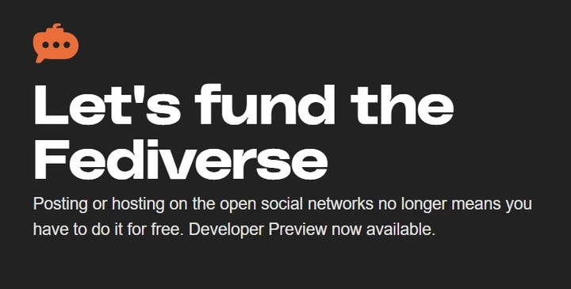
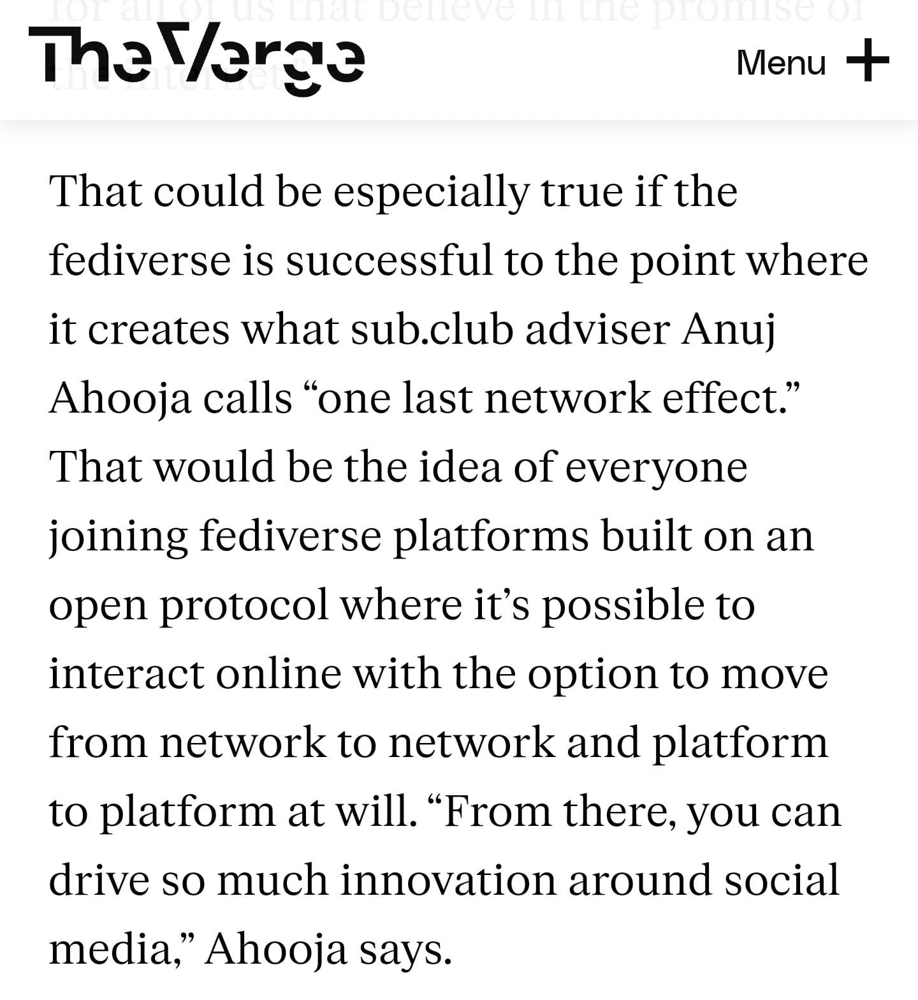
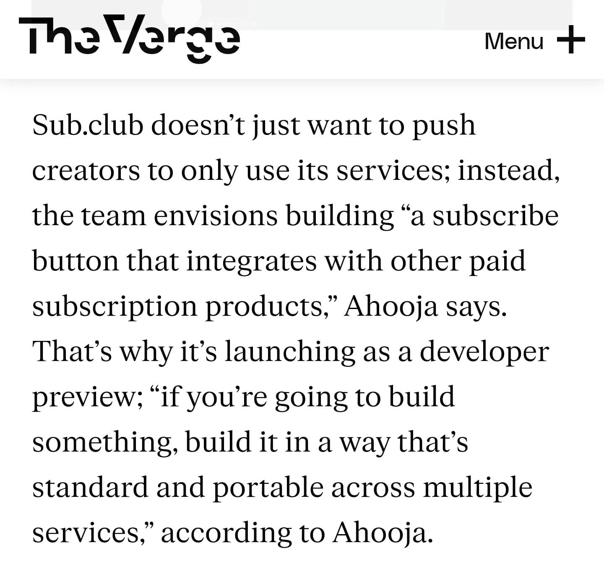
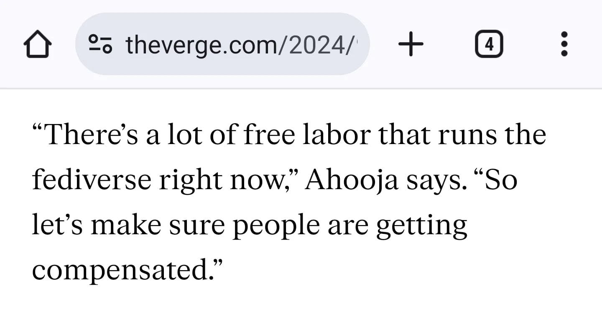
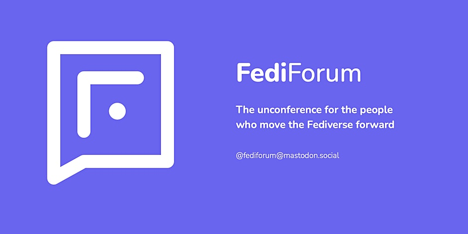
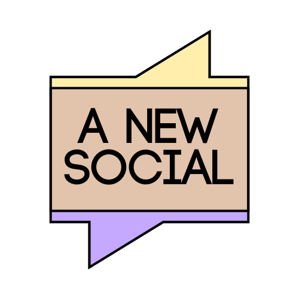
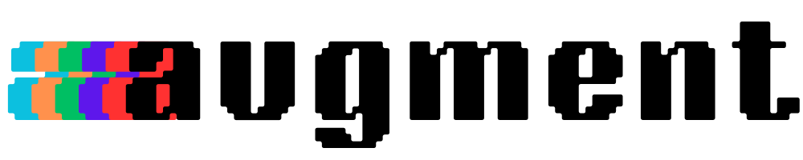

Hi folks!

*Phew*, it's been a while, hasn't it? I hope everyone is doing well, and hello to all my new subscribers! The last month has been busy, to say the least, and I wanted to give a few updates on what I've been working on.

### Hello, sub.club

First off, over the last few months I've been advising [sub.club](https://sub.club/), a payments tool built for ActivityPub. I've been harping on about how we need a [Patreon for the Fediverse](https://augment.ink/patreon-fediverse/), and it turned out the folks behind [Mammoth](https://getmammoth.app/) have been thinking about this as well. After a few short chats, I joined the team on a part-time basis.

We officially [launched a small-scale developer preview on August 29th](https://www.threads.net/@quillmatiq/post/C_Qz7V8vUJq), and we ended up getting a whole lot more interest than we thought we would. [TechCrunch](https://techcrunch.com/2024/08/29/sub-club-aims-to-fund-the-fediverse-via-premium-feeds/) was the first to share the news, our friends over at [WeDistribute](https://wedistribute.org/2024/09/subclub-paid-subscriptions/) went over what we've built and why it's exciting, while [The Verge](https://www.theverge.com/2024/9/1/24232298/sub-club-fediverse-make-money) interviewed us for our perspective on the social web.

Here's a few snippets from The Verge article that go over why I joined sub.club:

Snippets from The Verge's article about sub.club

The Verge's Nilay Patel and David Pierce also discussed the importance of something like sub.club on the social web [during an  episode of The Vergecast](https://www.threads.net/@quillmatiq/post/C_lj5CwOxVb).

All in all, it's been an exciting start to this project, and I look forward to continuing my work with them. There are a few more announcements about sub.club just around the corner and I can't wait for y'all to see what we've been cooking up!

You can also [subscribe to my sub.club](https://sub.club/@quillmatiq/subscribe) for some exclusive updates that are coming very soon 😉

### FediForum & WeDistribute
FediForum Banner
On September 12th, [FediForum](https://www.eventbrite.com/e/fediforum-september-2024-tickets-903892856867) - an online conference for the Fediverse - took place for three days. I was really excited about it because of how much progress various organizations and developers have made in the last few months.

I played a bit of a double agent this time around, as I [live-blogged with WeDistribute](https://wedistribute.org/2024/09/fediforum-september-2024/) while also representing sub.club in some of the sessions. It was a rewarding experience and I already can't wait for the next one!

Some highlights for me:

- Meeting new folks building in the social web, especially those who I've been interacting with online for months now
- Chatting with developers who want to work with sub.club
- Seeing all the updates from Ghost, Threads, Emissary/Bandwagon, IFTAS, and so many more
- Chatting with the WeDistribute folks about all the announcements

We also had many follow-up conversations after the events, which are leading to some interesting development opportunities. The next year is going to be *fun*.

I also have a long-form piece dropping on WeDistribute in the next couple weeks, so look out for that 👀

### A New Social 
A New Social logo
Building a company from scratch has been an incredible learning experience. I finally have my infrastructure all good to go, and I've started consulting with a few folks and organizations about how to approach the open social web. I also did my first presentation on the subject, and [the feedback was very positive](https://www.threads.net/@thetechsavvyassistant/post/DAZKqKWypTB?xmt=AQGz6Fsf-kVvJhykbFrvoEvIhrw_mVE5eXVFFDjgJSqV8g)!

Feels good, man.

It's been a lot of fun chatting about this with folks, so if you're interested in learning more, please feel free to reach out to me at [anuj@anew.social](mailto:anuj@anew.social).

Oh, and [Tomasto](https://anew.social/) is almost ready to go. More on that really soon 🍅

### Augment & Human-Generated Content
Augment logo
I'm finally bringing *Human-Generated Content* back after a hiatus. The next issue will be released on October 25th. Since it's been a while, I'll treat this as more of a round-up of news and updates I wasn't able to talk about over the last few weeks. So much has developed in the social web recently, and I want to share all of it with you.

Other than that, I've been working on a long-form essay about how I see the social web environment changing as more platforms join the Fediverse in the next few months. Threads, Flipboard, Ghost, and so many others seem to be lighting up more Fediverse features really soon, and I think this will have some deeply interesting implications for how users interact with the social web. I've been working on this one for a while so I hope you enjoy it!

Based on the other in-progress work I have in my backlog, I'll likely be moving to an almost weekly cadence with Augment by the end of next month. It's exciting because it was always my hope to get there, but now that all my other projects are more organized and I'm working on pieces in parallel, it's finally doable.

Oh, and did I mention we're at triple-digit subscribers now? I wasn't expecting to get there until next year! I'm so grateful that all of you have joined me on this journey. It's been amazing hearing your feedback and many of you have helped me grow so much since I launched this back in March. 

Thank you for your amplification, your constructive feedback, and your constant support 🫶🏼

### Back To Work

Some folks say I take on too much, but if I'm honest - I wake up every day excited to help build and educate about the future of the social web, and technology in general. It's such an exciting time to be watching this industry, and I have a feeling that in the future we'll be fondly looking back at this moment.

I'm not even close to burnt out; I'm fired up 🔥

See you a few weeks!

*Thank you for reading! You can follow me on the social web on *[*Threads*](https://www.threads.net/quillmatiq?ref=augment.ink)* and *[*Mastodon*](https://mastodon.social/@quillmatiq?ref=augment.ink)*. And if you want to be notified of future issues of augment and my newsletter "Human-Generated Content," you can *[*follow on RSS*](https://augment.ink/rss/)* or *[*subscribe here for free*](https://buttondown.com/augment)*!*
