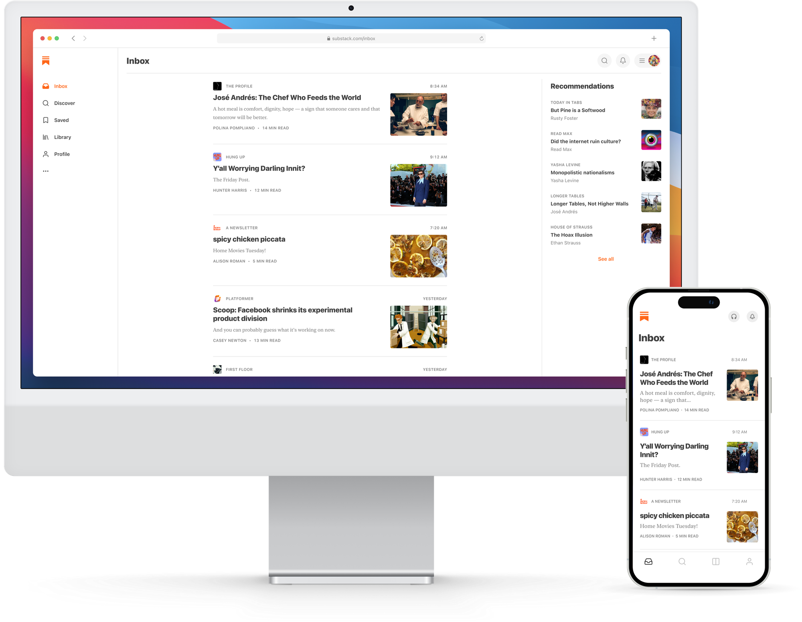
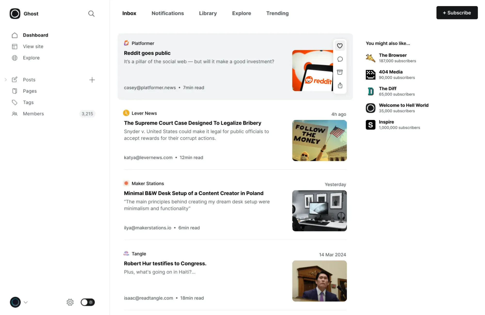
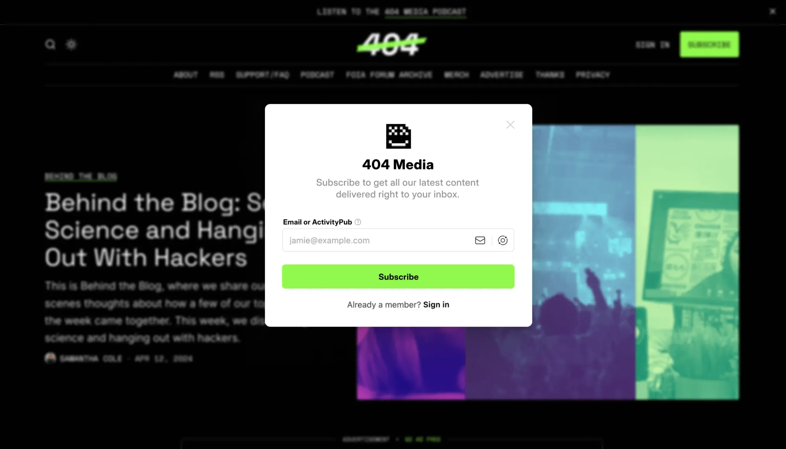

Ghost just announced that they'll be joining the Fediverse. I'm obviously very excited about it and if you want a deep dive into the features they'll be rolling out, I wrote about all of them in [my debut piece for We Distribute](https://wedistribute.org/2024/04/ghost-implements-activitypub/).

But these changes will have larger implications for the newsletter landscape. Namely, I think this will eventually bring the slow death of another [social silo](https://augment.ink/social-siloes-post/): Substack.
    
## Why I Picked Ghost

When I was looking to find a platform for [augment](https://augment.ink/), one of the major contenders was Substack. That being said, I have a lot of reservations about [the direction they're going with moderation](https://www.threads.net/@quillmatiq/post/C1ICMt2x1jP), I'm not a fan of how they [vertically integrated Notes](https://www.threads.net/@quillmatiq/post/C5TZ81MLmcF) instead of using ActivityPub, and I also didn't like the lack of design options. But Substack stayed on the list because their discoverability network was valuable for someone who was starting from scratch.

I obviously eventually went with Ghost in the end - Substack's moderation policy just didn't sit right with me - but I did sometimes peer over at some of the writers at Substack in jealousy over the network they got to be a part of.

But, today, I have no regrets. The upcoming discoverability features from Ghost will surpass anything Substack offers as it leverages the expansive potential of the Fediverse.

## A Distributed Explore Feed

I want to start this by showing a comparison between Substack's Inbox page and Ghost's Fediverse Inbox:
Substack InboxGhost Inbox
Looks pretty similar, right? Well, these two photos are not the same. As I wrote in [my piece on We Distribute](https://wedistribute.org/2024/04/ghost-implements-activitypub/):

> Ghost will now have an ActivityPub feed in their dashboard. This is similar to [Substack's Discover feed](https://on.substack.com/p/new-front-page), except rather than just Substack Notes and newsletters, Ghost users will be able to interact with profiles across Mastodon, Threads, Flipboard, or any other Fediverse service. For a lot of publishers on Ghost, this will likely end up being a replacement for their existing Fediverse account since it can house both their posts and their organization's social interactions.

The problem with Substack's Inbox is that it only includes Substack newsletters, RSS feeds, and their walled-garden "[Notes](https://on.substack.com/p/introducing-notes)" that you cannot access anywhere [except their feed](https://www.threads.net/@quillmatiq/post/C5TZ81MLmcF). 

Ghost, on the other hand, choosing to not go the walled-garden route is now tapping into what will be the [largest sharing network available on the internet](https://augment.ink/social-siloes-post/). Fediverse users will be able to reply, repost, quote post, and like your content directly - not a post pointing to it - on their Fediverse service of choice. Then, all their followers will easily be able subscribe the moment they see the interaction from whatever service they've chosen to use.

Due to these network effects, as more services federate - especially Threads - we are likely to see discoverability of Ghost publications skyrocket. 

## Complete Subscriber Portability

Substack currently lets you export your subscriber list, but there's a catch - you can only export users who subscribe to your newsletter through email. Users can also "Follow" a writer for their "Notes" which means a chunk of the publisher's followers are now stuck within the Substack platform with no portability.
Ghost treats ActivityPub subscribers as first-class citizens
Ghost will allow subscriptions in two ways: email and ActivityPub. That means that your full subscriber list is portable to any other platform that supports email and/or ActivityPub as well. You can leave the Ghost-hosted option and self-host your Ghost newsletter. You can take your email and ActivityPub subscribers and go to another Fediverse-supporting newsletter platform. 

Your content and complete follow graph remain in your ownership. No walled-off follow lists, no app-specific limitations - just a Fediverse service that enables you to be on the platform that makes the most sense for you. And the discoverability you worked so hard for comes with you.

## Reducing Subscriber Lift

Ghost coming to the Fediverse also lowers the barrier to entry to subscribe for many users.  They don't have to feel nervous about sharing their private email with a website they rightfully don't trust with that information quite yet. They also don't have to worry about their newsletters - especially paid ones - ending up in their junk mail. 

Adding a publication to a social feed is a lot smaller of an ask from users since their feed is a bit of a hodge-podge of their interests anyway. In fact, when I see a blog or newsletter for the first time, I don't subscribe by email - I add them to my RSS and I follow them on social media. Eventually, if enough content is interesting to me, I go and subscribe through email if I have to for paywalled content. Being able to follow as a paid subscriber through my Fediverse address completely skips that middle step and keeps all my newsletters in one place rather than distributed across services. This reduced user lift means more subscribers and you get to meet them where they already are.

This also reduces the lift for publishers to track their subscribers and followers across different platforms. Organizations can house their Fediverse address in the same place they write their articles, which means they get combined metrics between email and social media all in one place.

## Make the Move

It's more than clear at this point that [if you live in a social silo](https://augment.ink/social-siloes-post/) you will continue to be isolated from a much larger cohort of users that are all interacting across services. Substack's greatest strengths of discoverability and portability are no longer as valuable and writers should start looking at newsletter options that keep them in control of their content and subscribers.

While Ghost is one of the publisher platforms that's making this move, [ButtonDown](https://buttondown.email/), [Micro.blog](https://micro.blog/), and [WordPress](https://wordpress.com/) are three of the many other services that will provide you with the wealth of Fediverse subscribers you're currently held back from on Substack.

If the lack of moderation wasn't the reason you left Substack, and you stayed because that's where discoverability is, it's time to look outward because there's a large chunk of users waiting to subscribe to you through their social media accounts. Don't be held back by a walled garden.

*Thank you for reading! You can follow me on the social web *[*Bluesky*](https://bsky.app/profile/quillmatiq.bsky.social?ref=augment.ink)*, *[*Mastodon*](https://mastodon.social/@quillmatiq?ref=augment.ink)*, and *[*Threads*](https://www.threads.net/quillmatiq?ref=augment.ink)*. And if you want to be notified of future issues of augment and my newsletter "Human-Generated Content," you can *[*follow on RSS*](https://augment.ink/rss/)* or *[*subscribe here for free*](https://buttondown.com/augment)*!*
