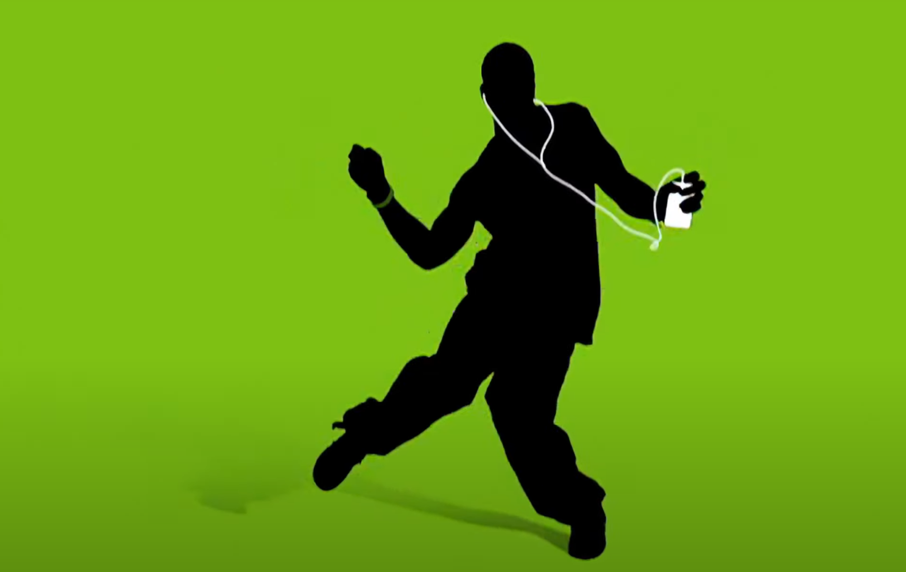

Screencap of Apple's [Technologic iPod Ad](https://www.youtube.com/watch?v=raXZelsYxKk) from 2004
> "And I hope that, with our innovation, [Google] will definitely want to come out and show that they can dance. And I want people to know that we made them dance, and I think that'll be a great day" 

That's what [a confident Satya Nadella](https://www.youtube.com/watch?v=QinFy0RFDr8), CEO of Microsoft, said after the launch of Bing Chat, the predecessor to Copilot.

Boy, did they make Google dance.

## Two Left Feet

Google launched their Generative AI-based search this week and it's going very not so good. Across the internet, people are finding that Gemini - like other LLM services like it - tends to lie. A lot. Like, [put Elmer's glue on pizza](https://www.theverge.com/2024/5/23/24162896/google-ai-overview-hallucinations-glue-in-pizza) and [eat rocks](https://www.threads.net/@crumbler/post/C7VGpYSPOgT?xmt=AQGzc4PKF9MwmvFYXL6WTiB6mAuuaL1vuviEngsoNN9HJL4) kind of lies. It also lies [on serious topics](https://www.cnbc.com/2024/05/24/google-criticized-as-ai-overview-makes-errors-like-saying-president-obama-is-muslim.html) too. 

And it's a [known problem](https://www.theverge.com/2024/5/23/24163667/bold-yet-responsible-and-crunchy) that doesn't have a solution.

We all saw this coming, right? From ChatGPT and Bing Chat's early hallucinations to Google's Gemini having [a pretty bad start itself](https://www.npr.org/2024/03/18/1239107313/google-races-to-find-a-solution-after-ai-generator-gemini-misses-the-mark), it was clear that this technology wasn't ready to play at the scale of something as big as the portal to the entire internet. 

Google used the most important real estate on the internet to paraphrase Reddit trolls and satire websites, pushing informed answers further down the page. They danced, tripped on their own feet, and it's going to take a long time for them to heal their twisted ankle.

## Hol' Up, Let Tim Cook

But where do the rest of us go from here? Every company that owns the platforms that run our lives are currently caught up in the AI buzz. One of those is Apple, and while there haven't been any official announcements, [Tim Cook has confirmed](https://www.theverge.com/2024/2/1/24058647/apple-ceo-tim-cook-teases-generative-ai-iphone) that the company has been working tirelessly to add AI features to their products.

Apple is apparently about to step on the dance floor in a few weeks at WWDC and, to be completely honest, I'm a bit nervous for them.

One rumor suggests that they're [paring up with Google](https://www.bloomberg.com/news/articles/2024-03-18/apple-in-talks-to-license-google-gemini-for-iphone-ios-18-generative-ai-tools) for generative AI features. If it's just photography tools or better auto-correct, that's probably a great idea. But if they were planning on replacing the engine under Siri for Gemini, this launch from Google may convince them otherwise. 

There have also been rumors that [Apple's working closely with OpenAI](https://www.bloomberg.com/news/newsletters/2024-05-19/what-is-apple-doing-in-ai-summaries-cloud-and-on-device-llms-openai-deal-lwdj5pkz). But the non-profit is going through [a controversy of its own](https://www.nbcnews.com/tech/tech-news/scarlett-johansson-shocked-angered-openai-voice-rcna153180), stressing an already-strained relationship with creatives. Apple also recently [brought the ire of creatives](https://www.theverge.com/2024/5/9/24153113/apple-ipad-ad-crushing-apology) with its "Crush" ad, which means they're likely walking on thin ice for the next little while with that community as well. Tying the knot with OpenAI may raise a lot of eyebrows.

The last option is to go full-Apple - build an in-house competitor that's only available through Siri on their hardware. To be honest, there's very little that Apple could do to Siri to make it feel worse than it already is, so betting on themselves and hoping it gets better over time [like Apple Maps](https://www.androidpolice.com/apple-maps-good-now-problem-google-maps/) is probably the right bet.

Or maybe the right bet is go the route Apple is best known for - sitting quiet and waiting for the promises of AI to match real-world experience expectations. To me, the biggest mic drop Tim Cook could make on the WWDC 2024 stage is "Y'all see how bad this is right? We don't want to get anywhere near it." 

But line must go up and, if we've learned anything in the current phase of tech, GenAI makes the line go [very, very ,very up](https://www.cnbc.com/2024/05/23/nvidia-stock-pops-10percent-to-record-high.html).

I hope Tim brings the right dancing shoes.
