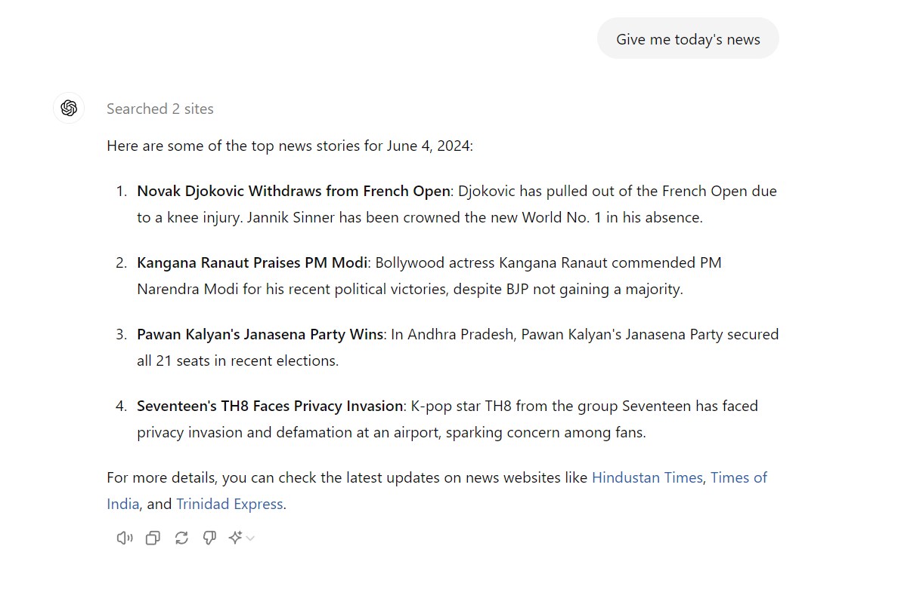

Hello, again! 

The first edition of this series brought the largest amount of new subscribers augment has ever seen, so I want to start by thanking all of you for joining me on this journey. As you can probably tell, I'm still trying to figure this out but I hope I'm leaving you with a few nuggets of knowledge and context with each post I leave in your inbox. 

Before we jump in: I also wrote two other pieces on augment in between issues. Check them out if you haven't yet, I'm really happy with how they turned out:

- [Google Danced - Will Apple?](https://augment.ink/google-danced-will-apple/)
- [Patreon Belongs in the Fediverse](https://augment.ink/patreon-fediverse/)

For this edition, I want to talk about two conversations happening around the future of journalism. One side sees the end-times and is handing their content to be aggregated and summarized for easy consumption. The other side also sees the end-times, but is opting to change the way they distribute and build their audience. Yup - it's another AI and Fediverse conversation. But I also warned you it would be last time so I hope it isn't a surprise.

So let's look at these two forks in the road and see what their potential for the future is.

## The Publisher's Dilemma 

I want to start this with [a blog post by Ben Werdmuller](https://werd.io/2024/dispatches-from-the-media-apocalypse) (Senior Director of Technology at ProPublica) that summarizes the current social media news landscape, different business models that have been attempted in the past, and the various solutions ahead of them.

> We’re at the foothills of both changes: social media is likely to fragment further, and generative AI will become even more prevalent as it becomes more powerful. Newsrooms can no longer rely on their old tactics to reach their audiences, and they will need to build new tactics that take these trends into account if they hope to survive.

So here we are: the distribution strategies of the 2010s are looking a whole lot like the newsstands of the mid-2000s. The first time, the newsstands scaled back because the audience changed the way they consume the news. This time, however, it's because the newsstands themselves have either decided they don't want to sell the news or that they would rather summarize the day's news instead - sometimes lying to you confidently as they do.

There's a lot of more in Ben's piece and I urge you to read it, along with [subscribing to his newsletter](https://newsletter.werd.io/). His experience in the industry has taught him about the dynamics between journalism and technology and I've learned a lot from reading his work. 

I want to add another description from the piece:

> These organizations must own their digital presence outright to shield themselves from risks created by third parties that wield outsized supplier power over their business models. They must build direct relationships with their communities, prioritizing open protocols over proprietary systems. They need to invest in technology expertise that can help them weather these changes and make that expertise a first-class part of their senior leadership teams.

So, which one are publishers choosing - open protocols or proprietary systems? Well, it's complicated.

## Publishers Turn to AI Companies

Let's start with the publishers opting into proprietary systems. Namely, in the last few weeks [Vox, The Atlantic, and News Corp](https://www.axios.com/2024/05/29/atlantic-vox-media-openai-licensing-deal) have all signed deals with OpenAI. These deals go two ways - OpenAI gets a pipeline of up-to-date news content to add to their models and publishers get deals on OpenAI tools, some of which will actually be really useful for both the publisher and its readers.

It is important, however, to note that how news content will surface on ChatGPT is still unclear once these deals have a tangible impact on the experience. When I ask for the day's news on the platform today, this is what it looks like:
OpenAI responds with what it considers the four top news stories of the day
First off, these are definitely not the biggest news stories of the day—there's an election happening in India and a Bollywood actress's endorsement is certainly not the most important part of it. But I digress.

Another thing to note about this response is the attribution: it does link me to news sites where some of this is sourced but it doesn't take me to the article, it takes me to the homepages. There are no quotes from the pieces and no authors called out. There's four stories with three sites and it doesn't tell you which stories line up with which publications. Now, maybe all this will change after these deals but I currently see no real benefit to the media businesses other than an upfront, short-term bank deposit. 

But it somehow gets worse. The next day I got more specific about what news I want to focus on and ChatGPT just straight up lied to me:
![Me: Tell me about yesterday's elections in India. ChatGPT: The 2024 Indian general elections concluded with the counting of votes on June 4. These elections were conducted over seven phases from April 19 to June 1. The final results declared that the Bharatiya Janata Party (BJP) secured a significant victory, solidifying its position with a majority in the Lok Sabha.  The BJP-led National Democratic Alliance (NDA) won a decisive majority, with the BJP alone securing 303 seats. This result marked another strong performance by the BJP, led by Prime Minister Narendra Modi, who is set to continue his tenure​ (IndiaTimes)​​ (Free Press Journal)​.  In addition to the national elections, state assembly elections were also held in Andhra Pradesh, Odisha, Arunachal Pradesh, and Sikkim. The BJP made notable gains in Odisha, winning 78 seats in the 147-member state assembly, marking a significant political shift in the state​ (India Today)​.  Overall, the election saw a high voter turnout and reinforced the BJP's dominance in Indian politics, both at the national and state levels.  Me: This isn't true, the BJP did not win a majority ChatGPT: The 2024 Indian general elections resulted in a hung parliament, with no single party securing a clear majority. The Bharatiya Janata Party (BJP), led by Prime Minister Narendra Modi, did not achieve the expected majority. Instead, the opposition coalition known as the INDIA bloc made significant gains, creating a more balanced power distribution in the Lok Sabha.  The BJP and its allies won around 240 seats, falling short of the 272 needed for a majority. In contrast, the INDIA bloc, a coalition of various opposition parties, secured approximately 220 seats. This outcome has led to a highly competitive and uncertain political landscape, with both blocs needing to negotiate with smaller parties to form a government​ (Hindustan Times)​​ (India Today)​.  In the state assembly elections, the BJP saw mixed results. They managed to secure a win in the Odisha state assembly with 78 seats, marking a significant political shift in the state​ (India Today)​. However, the overall national outcome has created a scenario where coalition politics will play a crucial role in the formation of the next government.](./_assets/gpt-2.png)ChatGPT thinks that the BJP won the majority in the 2024 Indian elections. They did not.
This time it does a marginally better job of attributing the news to its sources, but fails at actually being accurate about the most important news coming out of the Indian elections. Am I supposed to trust ChatGPT as a source of up-to-date truthful journalism? Am I supposed to click on the links, go to the homepage of the news site, then search for the sourced story to confirm what ChatGPT says? Why are media brands trusting this system in its current state? I have so many questions.

If we ignore the truth - which is a really weird thing to ignore - there's another major problem here. What I see here is the further consolidation - or as Kyle Chakya would say, [flattening](https://www.penguinrandomhouse.com/books/695902/filterworld-by-kyle-chayka/) - of the media industry. ChatGPT didn't attempt to look at multiple different news sites for the same story to get multiple perspectives, they chose at most two. In other words: unlike the ten links in Google Search or even the "Full Coverage" option in Google News which enables the user to get multiple viewpoints, ChatGPT is choosing a couple sources based on who made deals with them.

Not to get political here, but if a news story on ChatGPT is going to be sourced from a News Corp entity, I really want it to look for different perspectives. If that's where OpenAI's information is coming from, I likely won't be trusting it. I think Vanessa Otero - Founder/CEO of Ad Fontes Media, the organization that invented the Media Bias Chat - [said it best](https://www.threads.com/@vanessa_lea_otero/post/C7VjgMlMS5P):

> The rise of misinformation was mostly from bad actors and extreme partisans polluting news and political information. It increased the work required to know what was true in the news, which made a lot of people not trust any news.

> AI summaries are mostly from enormous tech companies, polluting every kind of information, even the banal, which increases the work required to know what is true anywhere, which is making a lot of people not trust any information. This is worse.

It also looks like the journalists on the ground floor aren't all that happy about this decision as well. Vox reporter Bryan Walsh had [swift pushback for his employer](https://www.vox.com/technology/352849/openai-chatgpt-google-meta-artificial-intelligence-vox-media-chatbots):

> But while I’m not a media executive, I have been working in this business for more than 20 years. In that time, I’ve seen our industry pin our hopes on search engine optimization; on the pivot to video (and back again); on Facebook and social media traffic. I can remember Apple coming to my offices at Time magazine in 2010, [promising us](https://www.nytimes.com/2010/02/01/business/media/01carr.html) that the iPad would save the magazine business. (It did not.) 

> Each time, we are promised a fruitful collaboration with tech platforms that can benefit both sides. And each time, it ultimately doesn’t work out because the interests of those tech platforms do not align, and have never fully aligned, with those of the media. But sure — maybe this time [Lucy won’t pull the football away](https://www.youtube.com/watch?v=mC5MzvgE4c0).  

Tell us how you really feel, Bryan.

The Verge's Editor-in-Chief, Nilay Patel had a bit of [a different - or indifferent - reaction](https://www.threads.com/@reckless1280/post/C7juyV6xRrY) to the news of his employer's partnership with OpenAI:

> I don't have a lot to say about this -- our newsroom is independent of the company's business dealings as it's always been. We'll figure out some disclosure language and do a disclosure when it's appropriate, we are pretty good at those ;)

And based on The Verge's recent moves, it's pretty clear that Nilay is planning on taking his newsroom in a very, very different direction. In fact, let's talk about it.

## Publishers Turn to the Fediverse

In parallel, another conversation is happening around a direct-to-audience strategy using social web protocols like ActivityPub.

 Sara Guaglione from Digiday [reports](https://digiday.com/media/why-publishers-are-preparing-to-federate-their-sites/):

> The Verge and 404 Media are building out new functions that would allow them to distribute posts on their sites and on federated platforms – like Threads, Mastodon and Bluesky – at the same time. Replies to those posts on those platforms become comments on their sites. 

I mentioned in [the last edition](https://augment.ink/human-generated-content-1/) of this newsletter that Semafor and The Verge have both been transitioning their distribution to using open social protocols like ActivityPub. In the long-run, The Verge wants to be a Fediverse-first publication. But as they work through this transition, The Verge - along with Semafor, 404Media, and WeDistribute among other publishers - are using Flipboard as a pipe into the social web.

One thing to note about 404 Media is that they're currently hosted by Ghost, the same newsletter engine "Human-Generated Content" runs on. While 404 Media is currently piping through Flipboard, [Ghost is also on the path of federating](https://augment.ink/ghost-substack-discoverability/) using ActivityPub. This means that with little to effort, all media organizations using the platform will be able to enter the Fediverse with the flip of a few switches.

Yet another publisher that's on Ghost that's also bullish on the Fediverse is Platformer, the popular newsletter by Casey Newton and Zoe Schiffer. In a [conversation with PJ Vogt](https://pjvogt.substack.com/p/how-do-we-survive-the-media-apocalypse) on his podcast "Search Engine", both Casey and PJ have a long, grim conversation about what AI means for the future of publishing. But Casey states the solution of what to do about it bluntly: 

> "We have to finish building the Fediverse"

Casey built Platformer as a direct-to-audience newsletter on day one and it's clearly worked out for him. He leveraged the audience and network he built while writing at The Verge, including his popular newsletter series "The Interface", and built a media business from the ground up using Substack while also syndicating some his content.

Now, Casey wasn't the first to run the [POSSE](https://www.theverge.com/2023/10/23/23928550/posse-posting-activitypub-standard-twitter-tumblr-mastodon) playbook, but he was definitely one of the few writers that understood how to run the blitz. He launched a Discord server "Sidechannel" for paid subscribers, he was hosting Twitter Spaces with Kara Swisher during the pandemic, he was booking interviews with Mark Zuckerberg, and he was picking up scoop after scoop in back-to-back issues. He took his audience and gave them strong reasons to stick around.

I think The Verge has seen how they can be an incubator for talent and their new homepage design is, what I believe, a direct influence of that realization. The Story Stream looks like a microblogging platform's For You feed and the writers treat it as such. As they focus on their shift to the Fediverse, I have a strong feeling they'll be importing their brand and author profiles to an organization-owned ActivityPub server. Authors could post from The Verge to reach their audience across all protocol-supporting platforms as if they were using Threads or Mastodon and The Verge's brand profile could repost them when it's appropriate, centering the writers behind the work rather than just the entity. If you want to see a sneak-peek of such a system, an enthusiast brought The Verge's Story Stream to the Fediverse on [theverge.space](https://theverge.space/). Pretty cool, huh?

They've decided to invest in their own technology using open protocols rather than depend on proprietary systems. At this point, if you're not looking at these publishers as social web platforms that are hosting hand-picked bloggers, podcasters, and content creators with a publisher's infrastructure, you're not paying attention. 

## Until Next Time

My goal for the next issue is to not talk about the Fediverse. It's going to be tough but I think there's a lot of Human-Generated Content that's not related to the future of social media and I want to make sure I surface it as well. We'll see if I can keep that promise but...well, we'll see.

So, until then - hope you have a great couple weeks ✌🏼

*I hope you enjoyed this issue of Human-Generated Content! If you want to be notified of future issues and other posts on augment, you can *[*follow on RSS*](https://augment.ink/rss/)* or *[*subscribe here for free*](https://augment.ink/#/portal/)*. You can also follow me directly on *[*Threads*](https://www.threads.net/quillmatiq?ref=augment.ink)* and *[*Mastodon*](https://mastodon.social/@quillmatiq?ref=augment.ink)*.*
