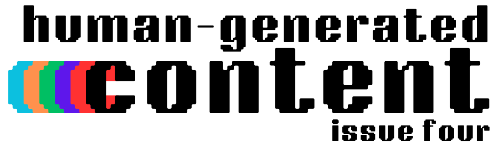

On June 24th, Paramount Global announced that it's [shutting down MTVNews.com](https://variety.com/2024/digital/news/mtv-news-website-archives-pulled-offline-1236047163/), erasing over two decades of cultural history recorded by people passionate about preserving important cultural moments through their crucial journalism.

On June 24th, two AI music companies –  Suno and Udio – were [sued by record labels via the RIAA](https://www.theverge.com/2024/6/24/24184710/riaa-ai-lawsuit-suno-udio-copyright-umg-sony-warner) for using decades of copyrighted music they had not licensed for training their models, generating near-exact copies of songs included in their training.

On June 26th, Paramount Global announced that it's [shutting down Comedy Central's website](https://latenighter.com/news/paramount-axes-comedy-central-website-show-clips-library/) after twenty-five years, erasing years of video content from Jon Stewart, and Stephen Colbert, among others who built the foundation for late-night talk shows and created comedy history.

Over the last month, we've learned that at least three AI companies – [OpenAI, Anthropic](https://www.businessinsider.com/openai-anthropic-ai-ignore-rule-scraping-web-contect-robotstxt), and [Perplexity](https://augment.ink/human-generated-content-3/) – are ignoring a web-wide handshake requesting bots not to scrape content from a page, even after some [promised to respect it](https://platform.openai.com/docs/gptbot).

### Culture is either being erased or regurgitated back at us, and the people who created and recorded it have none of the power to stop it from happening.

---

---

### Culture Erased

I want to start today with a video by Rob Markman, a former employee of MTVNews.com. Markman has worked as a hip-hop journalist for almost twenty years, putting work in at iconic organizations like XXL, Scratch, Complex, Genius, and – of course – MTV. With his extensive experience across print and online media, he's written history time and time again. 

After learning that so much of his and his colleagues' work is being wiped away, he wanted to share his feelings and discuss his plans to ensure his work isn't erased again.

Markman's video is the inspiration for this newsletter issue. It's a story we all need to understand from the source and is a required watch for anyone who cares to understand how much culture we just lost. So while I use some descriptions for context – please first hear [what Rob has to say](https://youtu.be/cDMDhhIbxII).

Video interviews with Kendrick Lamar before *Section.80* and *good kid, m.A.A.d city*. Important moments with Nipsey Hussle and Mac Miller. The first interview with Joey Bada$$. Gone.

> "What about the work that all of the writers, all of the producers, all of the editors? The whole staff for decades and decades put in the work - they have nothing to show for it anymore. Their work is gone."

> "What about the folks who weren't there who have to go back and research what actually happened, what was actually said, what was actually going on [...] Our future generations lose access to that information and it just becomes hearsay."

While [the Internet Archive has saved some of it](https://variety.com/2024/digital/news/mtv-news-articles-internet-archive-wayback-machine-1236058997/) – a resource that's also [consistently in danger of being shut down](https://lunduke.locals.com/post/5556650/the-internet-archives-last-ditch-effort-to-save-itself) – hip-hop culture has lost a significant chunk of history. These are snapshots, so they don't include any proprietary video content. Instead, where videos normally appear, [there's a broken player](https://web.archive.org/web/20140819100844/http://www.mtv.com/news/1682358/joey-badass-1999-mixtape/) left behind. It's probably why we haven't heard similar news about Comedy Central's site which is mostly videos.

Knowing all of this, Markman has taken important steps to preserve his digital footprint and ensure he owns his work personally. For one – his studio, editing process, and content distribution are done solely by him. He's chosen YouTube as his platform, but since he owns his content, he can distribute it anywhere he likes and gain an audience from multiple platforms. If YouTube ever shuts down, he can still take those videos under his ownership and move them elsewhere. His content can exist where he wants it to.

It's not a new idea, but as Anil Dash points out in his piece about [the New Alt Media](https://anildash-blog.glitch.me/2024/06/14/the-new-alt-media/), there is a resurgence of reporters and creators who worked in large publications stepping out to build their own smaller shops. Not to grow exponentially year over year or eventually build out staff, but to report the news no one else is telling that they care about. 

It's also important for this to happen since our cultural history is being misused in countless ways.

### And Regurgitated

I want you to listen to [this song](https://suno.com/song/16df3d1e-f817-4904-b9a8-eb6b18b6583d). I would ask if it sounds familiar, but...c'mon, right? 

Over the last few months, it's become apparent that AI companies are using copyrighted materials without purchasing licenses to use that content. Of course, none of this surprises us because it's been obvious from day one. You don't get [a Drake voice](https://www.theverge.com/2023/4/18/23688141/ai-drake-song-ghostwriter-copyright-umg-the-weeknd) without training on lots of Drake data. 

But now, [the RIAA is suing Udio and Suno](https://www.theverge.com/2024/6/24/24184710/riaa-ai-lawsuit-suno-udio-copyright-umg-sony-warner), companies that make AI-generated music, and they're using tracks like the one above to prove their point. As Mia Sato of *The Verge* reports:

> In its complaints, RIAA included several examples of outputs generated using Suno and Udio that sound like songs owned by labels. One song generated by Suno titled “Deep down in Louisiana close to New Orle” [sic] replicates the lyrics and style of “Johnny B. Goode” by Chuck Berry. Another song called “Prancing Queen” generated using the prompt “70s pop” contains lyrics to “Dancing Queen” by ABBA — and sounds remarkably like the band."

Before we go on, I want to make something really clear: not all AI is bad AI. There are applications of this technology that will improve our lives in real ways, whether in medicine, climate science, or even an assistant to help organize some thoughts. 

What I do have a problem with is that AI companies train their models by misusing online work – without any permission or financial benefit to the people and infrastructure that brought it to life. Not only is it learning from unethically sourced content, but it's also often just [Plagiarism as a Service](https://augment.ink/human-generated-content-3/).

A further extension of this problem makes me nervous: Recently, numerous media companies have shut down or sold once-major publications, and at the same time, media companies have also signed deals with AI giants like OpenAI. 

There will be a point in time when media behemoths like Paramount will have licensed content to AI companies from publishers that they've shut down, like MTVNews.com. That would make all that work only accessible through a chatbot's imperfect recollection of that history with no attribution to the humans that did the work behind it. A chunk of our cultural history will only be available through the regurgitations of non-deterministic chatbots, leaving us with a sloppy version of the work humans once did without any benefit to the people behind it.

Where do we even go from here?

### A Collaborative Approach

Tim O'Reilly of *O'Reilly Media* has an obvious solution to this [in his essay about solving AI's original sin](https://www.oreilly.com/radar/how-to-fix-ais-original-sin/):

> "Pay for the output, not the training [...] When someone reads a book, watches a video, or attends a live training, the copyright holder gets paid. Why should derivative content generated with the assistance of AI be any different?"

> My point is that one of the frontiers of innovation in AI should be in techniques and business models to enable the kind of flourishing ecosystem of content creation that has characterized the web and the online distribution of music and video. AI companies that figure this out will create a virtuous flywheel that rewards content creation rather than turning the industry into an extractive dead end.

O'Reilly's concept focuses on building incentives for creation that attribute and give back to the content that helped drive the outputs. This is what he calls the “generative AI supply chain”. If we have to live with AI, we should all be forcing these companies to source and compensate their sources ethically. 

> "Can you imagine a world where a question to an AI chatbot might sometimes lead to an immediate answer, sometimes to the equivalent of [...] “I can’t do that for you, Dave, but the New York Times chatbot can.” At other times, by agreement between the parties, an answer based on copyrighted data might be given directly in the service, but the rights holder will be compensated."

In an ideal world, independent creators like Rob Markman can do journalism at the source and put it in a package they prefer (video, audio, written, etc.). AI search engines can then source and attribute that content with payment back to the creator when someone asks a related query, even embedding his video for a user to watch the full content for further context. 

And O'Reilly isn't just talking the talk; his media company is building exactly this for their "Answers" chatbot:

> Because we know what content was used to produce the generated answer, we are able to not only provide links to the sources used to generate the answer but also pay authors in proportion to the role of their content in generating it.

There are still two major issues with this. One of them, O'Reilly specifically calls out, is that these outputs need to be credible. In other words, hallucinations will be a major roadblock in solving these problems. 

The other problem is systemic and one [we've discussed in this newsletter before](https://augment.ink/human-generated-content-2/):

> "What I see here is the further consolidation of the media industry. ChatGPT didn't attempt to look at multiple different news sites for the same story to get multiple perspectives, they chose at most two. In other words: unlike the ten links in Google Search or even the "Full Coverage" option in Google News which enables the user to get multiple viewpoints, ChatGPT is choosing a couple sources based on who made deals with them."

While a compensation model that aligns with license holders is a step forward, we don't live in that ideal world I mentioned before, and larger media conglomerates are likely to win the chatbot response lottery. [Google Search already prioritizes more established brands](https://sparktoro.com/blog/an-anonymous-source-shared-thousands-of-leaked-google-search-api-documents-with-me-everyone-in-seo-should-see-them/) in its search algorithm, so we don't have much evidence that it'll be different this time. 

So, while AI tools are seemingly inevitable and can benefit creators if built right, the best distribution tools will always be the ones that help creators directly interact with their communities and enable them to own their content. Ultimately, the solution must still be building [your web of webs](https://augment.ink/human-generated-content-3/) to elevate independent creation. 

As I said in the previous issue:

> "The new web economy is handmade, original, and delivered by humans. That's quite delightful if you ask me."

More on that part in the future.

For now, I hope that in this cycle of tech platforms, we have more companies like O'Reilly – building with empathy for the creators behind the work that powers their products instead of treating them as free resources for slop.

---

*I hope you enjoyed this issue of Human-Generated Content! If you want to be notified of future issues and other posts on augment, you can *[*follow on RSS*](https://augment.ink/rss/)* or *[*subscribe here for free*](https://buttondown.com/augment)*. You can also follow me directly on *[*Threads*](https://www.threads.net/quillmatiq?ref=augment.ink)* and *[*Mastodon*](https://mastodon.social/@quillmatiq?ref=augment.ink)*.*