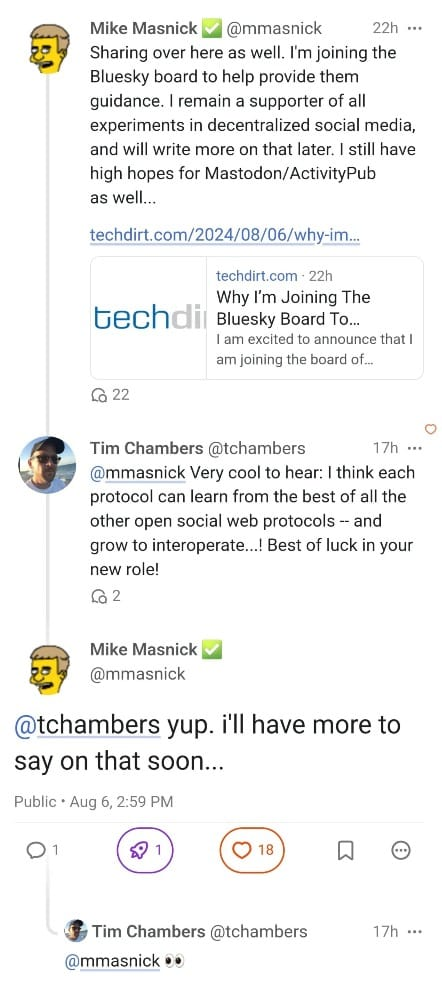

Hi there!

Today, we'll be talking about how companies have kicked off an effort to educate users, creators, and organizations about the Fediverse, along with a quick peek into a small part of the human internet.

But first, a couple of things:

1. I recently announced my new venture, [*A New Social*](https://anew.social/), where I'll be building tools and services for the Fediverse. The first tool is called *Tomasto*, which focuses on helping Threads users understand the Fediverse and all its benefits. More on that soon.
2. On WeDistribute, [I wrote about Flipboard's next major step into the Fediverse](https://wedistribute.org/2024/08/flipboard-fediverse-following/). The company is really close to going full-blown federated, and some of its takes on the social web are truly unique.

On that note, let's get into it.

### Fediverse Education Efforts

It's been a couple editions of *Human-Generated Content* where I haven't talked about the Fediverse, and there's a lot that I want to share with y'all this time. In particular, I want to highlight efforts by social media companies doing the work to educate the world about the open social web.

Michael Foster of the Newsmast and Patchwork team [put together a post](https://www.blog-pat.ch/enter-the-fediverse/) about how Fediverse builders can help organizations and content creators join the Fediverse:

> We need to articulate why it’s better to have a federated blog on Ghost than a closed account on Substack. Why podcasts should be federated accounts. Why organisations need to turn on federation - not just on their Threads accounts - but on their websites, forums and blogs. That’s where Fediverse storytelling comes in. The campfires, the open spaces, the secret paradise. It’s the joy of the open web - a place for organisations to make a stake, grow, nurture, build a home.

One important call-out Foster makes that I want to highlight:

> Of the 2 billion websites in the world, around 43% run on WordPress. [...] There are over 6,000 installations, and a recent post by Eugen Rochko of Mastodon showed that Jetpack (WordPress) is the second largest source of posts on mastodon.social, after the Mastodon web UI. So from this Fedicentric point of view, the plugin is a success. 

This is key since WordPress now has a first-party ActivityPub plugin that not only syndicates content but also brings back replies as comments. With competitors like Ghost and ButtonDown already building ActivityPub natively, there's an opportunity in the next year or so for a large wave of sites to switch on federation without much work on the owners. We need to focus on explaining to these owners how to bring their sites to the Fediverse, especially at a time when distribution via Google will likely soon start to dwindle due to AI-generated responses.

Speaking of which, WordPress is stepping in to help with education as well, with a YouTube series with [Doctor Popular](https://mastodon.social/@docpop) called [*The Fediverse Files*](https://www.youtube.com/watch?v=BkN3SJbmvbw&amp;pp=ygUTd29yZHByZXNzIGZlZGl2ZXJzZQ%3D%3D). Their [latest video](https://www.youtube.com/watch?v=1JKszCKZxqQ&amp;pp=ygUTd29yZHByZXNzIGZlZGl2ZXJzZQ%3D%3D) is an enlightening chat with *Mammoth* CEO and Founder [Bart Decrem](https://moth.social/@bart), who discusses how we can make social media fun again. 

Flipboard has [*Dot Social*](https://dot-social.simplecast.com/), a podcast ([which I've referenced before](https://augment.ink/human-generated-content-1/)) where CEO and Co-Founder Mike McCue chats with various players in the social web about the work they're doing. The [latest episode](https://www.youtube.com/watch?v=XNX6f05z86E&amp;t=365s&amp;pp=ygUJZmVkaXZlcnNl) dives into the hard work IFTAS is doing with decentralized Trust & Safety. McCue also recently did [an AMA about the Fediverse](https://www.threads.net/@threads/post/C-TPGFLxa5D?xmt=AQGzJk3lmCJPDL_Lx3zeI2wZpLIPwAt50ZUX15E3SWYsgA) alongside [Tracy Chou](https://www.threads.net/@exhaustedfemalefounder) of Block Party on Threads.

Ghost has been giving [humorous weekly updates](https://activitypub.ghost.org/) about their ActivityPub integration, often diving into the complexities of building it into an existing ecosystem. They also gave a much-deserved shout-out to [Fedify](https://fedify.dev/), a Deno-based framework built by [Hong Minhee](https://fosstodon.org/@hongminhee) that makes it easy to bootstrap an ActivityPub server.

Foster isn't the only one spreading his knowledge from the Newsmast team either. [Saskia Welch](https://newsmast.social/@saskia), lead curator at Newsmast, has been blogging about important moments happening on the social web. One in particular that stands out is her post about "[Influencing Influencers](https://forbetter.ghost.io/influencing-influencers/)".

As numerous platforms get closer to federating, early education is important. We need to work to get the word out about the Fediverse and its benefits to every kind of user while also being honest about its shortcomings.

I've been attempting to do this with some of my own posts, namely [Ghost v. Substack](https://augment.ink/ghost-substack-discoverability/), [Threads on Mastodon](https://augment.ink/threads-on-mastodon/), and my push for [a Patreon in the Fediverse](https://augment.ink/patreon-fediverse/). [WeDistribute](https://wedistribute.org/), the not-for-profit publication I contribute to, has focused heavily on educating the public about different parts of the Fediverse. I also hope to do the same with my work at *A New Social*.

What are you planning on doing to spread the word? Feel free to [shoot me an email](mailto:anuj@augment.ink) if you're working on educating or building for the Fediverse!

### A Friendly Front Porch

On the polar opposite of the Fediverse, we have "Front Porch Forum," a small social network for residents of Vermont, US.

[Will Oremus of The Washington Post reports](https://www.washingtonpost.com/technology/2024/08/10/front-porch-forum-vermont-research-new-public/):

> On Front Porch Forum, there’s no real-time feed, no like button, no recommendation algorithm and no way to reach audiences beyond your local community. It offers users no reward for posting something provocative or sensational, other than the prospect that your neighbors will see it and perhaps bring it up the next time you run into them at the grocery store.

The network is heavily moderated and actively chooses not to be real-time. Instead, every post goes through a human moderator, and there are no algorithms or signals of what posts are popular. 

Typically, an online space with such overbearing moderation would result in angry pushback about free speech. But instead, it's a welcome part of the network and maintains a pleasant environment for debate.

> “What we say is, attack the issue, not the neighbor,” Wood-Lewis said. “If your issue is a barking dog or hypodermic needles in the park, then let’s talk about that. But don’t say, ‘This particular person’ or ‘This particular dog.’ We can’t fact-check that, and you could totally destroy someone’s reputation.”

Pre-emptive fact-checking of posts? That's probably the most innovative idea I've seen in social media in years.

While I'm all-in on the Fediverse, I strongly believe in corners of the internet that are still focused on groups of humans building a small community for themselves. Not everything needs to be syndicated everywhere; sometimes, a neighborhood augmenting its community on the internet while moderating itself is exactly what we need. More of this, please.

### The Sky Looks Bluer 

Lastly, I wanted to call out [Bluesky's announcement last week](https://bsky.social/about/blog/08-06-2024-board) about Mike Masnick, CEO and founder of *TechDirt*, joining its board. This a really exciting development, mainly because many of us who work in the social web were inspired by his piece "[Protocols, not Platforms](https://knightcolumbia.org/content/protocols-not-platforms-a-technological-approach-to-free-speech)." If anyone will give the right advice on where to take the network and the AT Protocol, it's him.

Masnick expands [in a post on *TechDirt*](https://www.techdirt.com/2024/08/06/why-im-joining-the-bluesky-board-to-support-a-vision-of-a-more-open-decentralized-internet/):

> You should be able to build a decentralized, open, protocol-based social network *without* most users knowing or even caring about it. You should be able to build a system just as usable and feature-filled as traditional, centralized social media systems, while still creating underlying technology and infrastructure that prevents it from exploiting users like those centralized platforms do.

I couldn't agree more. I spend more of my time on ActivityPub-related social platforms, but Bluesky absolutely nailed the onboarding process and has made the technology invisible unless you actually want to learn about it.

What excites me even more about Masnick being part of the team is this nugget he left in a Mastodon conversation:

I, for one, am looking forward to hearing what he has to say 👀

### Until Next Time

It feels good to be back in my pocket talking about the social web again. I wanted to discuss the impact of AI on human-made online content, but that meant there wasn't enough space to talk about the Fediverse. But we are *so* back.

Hopefully, y'all enjoyed this edition and learned something new. I have much more on the docket that I can't wait to share with you in upcoming posts and newsletter issues.

See you in a couple of weeks!

---

*I hope you enjoyed this issue of Human-Generated Content! If you want to be notified of future issues and other posts on augment, you can *[*follow on RSS*](https://augment.ink/rss/)* or *[*subscribe here for free*](https://buttondown.com/augment)*. You can also follow me directly on *[*Threads*](https://www.threads.net/quillmatiq?ref=augment.ink)* and *[*Mastodon*](https://mastodon.social/@quillmatiq?ref=augment.ink)*. 

*You can also email me at *[*anuj@augment.ink*](mailto:anuj@augment.ink)* with tips, comments, or anything cool you're working on.*