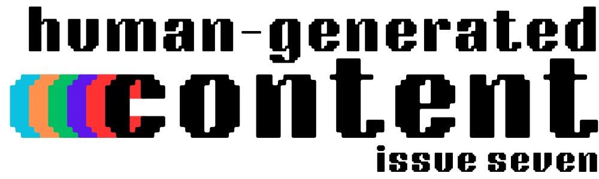

> "User-generated content continues to be tremendously undervalued by the platforms that distribute user-generated content" - John Green

The vlogbrothers have entered the conversation about the future of human-generated content, and you already know that I had to talk about it.

---

Hi there!

In this issue, we'll be diving into a discussion between Hank and John Green (the vlogbrothers) about how deals being struck between AI companies and platforms that host human creations are leaving behind the humans who made the platforms worth using. After that, I want to explore a success story about a media company aiming to avoid dependence on these platforms by investing in tools that help it own its content and audience.

The human-generated internet can have a bright future if we invest our content and time in the right places. The question is: do we have the collective will do it?

---

---

### The Rigged Internet

Over the last week, two pioneers of the creator economy, Hank and John Green, discussed an important fork in the road for the internet and the creators who depend on it.

Hank [started this discussion](https://youtu.be/JiMXb2NkAxQ) by diving into how Google (and all the other AI companies) is training its LLMs on YouTube videos without the creators' consent. He specifically notes that an odd amount of video content comes from YouTube properties built by them but concludes that the dataset was focused on educational video content. 

This makes sense—the educational content referenced is high-quality and fact-checked, which is exactly what AI companies need to output worthwhile answers through their chatbots and search engines. It's the same reason we're seeing [OpenAI make deals with well-established newsrooms](https://augment.ink/human-generated-content-4/) rather than prioritizing random news websites that are more likely to serve as free data.

He outlines his frustrations, one of which is that asking for permission and paying for content isn't an unprecedented option for AI companies:

> I know I'm getting ripped off because a bunch of big companies have signed licensing deals with AI companies so they can train on their data. So they're getting  paid for their data to be in the model, and I'm not getting paid for my data to be in the model [...] Why not pay me? Just because you didn't think you'd get caught?

The "Big Companies" Hank references here include publishers like *The Atlantic* and *Vox Media*, among many others that I've done a deep dive on [many](https://augment.ink/human-generated-content-4/), [many](https://augment.ink/human-generated-content-3/), [many](https://augment.ink/human-generated-content-5/) times. And that's a fair question - why do only *some* content sources deserve to get paid? 

John answers that in his [response video](https://youtu.be/QghbHQq6eHw): the popular platforms are rigged against independent creators due to a lack of bargaining power, while larger entities like the music industry, publishers, and platforms like Reddit have enough pull to make deals with OpenAI and Google.

This lack of power has always put creators in a position where they tend to get the short end of the stick, but most YouTubers give this a pass since they have it much better than creators on other platforms. But if even YouTube starts using that data without any benefit to the creators, how long will it feel like they're being compensated accordingly for the work they put in? As John notes:

> I would argue that long-term mutually-beneficial relationship is now at risk, because Google has [...] basically admitted to stealing our content to train large language models without our permission. These LLMs will generate literal billions of dollars for Google, and the users who generate the content that made those LLMs possible will get nothing.  

And John isn't alone in this thinking. We've seen other YouTubers like MKBHD [frustrated with the situation](https://www.youtube.com/shorts/xiJMjTnlxg4) since he pays for human-written captions for accuracy that AI companies take for free. 

John also raises one of my major concerns:

> It concentrates more capital and power into fewer and fewer hands, which over time [...] tends to work out terribly.

This concentrates capital and power not only with AI companies but also with the companies that make deals with them. For instance, if *The Atlantic* makes a deal with OpenAI, then ChatGPT will likely output news content from that source over others. Due to their bargaining power, *The Atlantic* and other large publishers can monopolize that distribution channel, pushing newer, smaller media companies out before they can even get started.I wrote more about that dreaded future [here](https://augment.ink/human-generated-content-2/), but I also believe in a better path forward.

### The Unrigged Internet

Hank and John absolutely nailed the problems creators face in this phase of online platforms and media distribution. We've spent years on sites like YouTube because we thought we were helping seize the means of production, only to learn that the creators don't own the content or the relationship with their audience.

But it's important to remember that the *internet* is not rigged but rather the platforms we've given power to. A rich, forgotten part of the internet still exists, and we've been discussing it since [the first issue of this newsletter](https://augment.ink/human-generated-content-1/) via [a brilliant post by Molly White](https://www.citationneeded.news/we-can-have-a-different-web).

The internet we currently choose to live on—the YouTube, Instagram, and TikTok internet—is rigged against us because of the walled-garden nature of these platforms. These services, while advancing media and making a space for creators such as the vlogbrothers, do not enable creators to own their products. Instead, they depend on closed network effects that trap us in their ecosystem, making it impossible to export our content and audience to competing services if we strongly disagree with their direction (like using our content for their LLMs).

So how do we escape? As Hank called out in his video:

> "[...] individual independent creators who all have fairly big audiences, and those audiences will absolutely go to bat for them when asked to."

If we don't want the internet rigged against us, big creators with dedicated audiences will soon need to start urging their followers to move to services that don't lock us in and don't use our data without our permission. We must push toward the Fediverse, where creators can import and export their content and audience between compatible networks. But we still have some way to go before it's ready for creators.

Within the next year, we'll likely see services like Threads, Flipboard, Ghost (where this newsletter is hosted), Buttondown, and WordPress, among many others, become compatible. That would mean users on Threads and Flipboard can follow a newsletter like Human-Generated Content directly in their respective feeds. And if I don't want to use Ghost as my platform, I can move over to WordPress or Buttondown without losing my followers. 

Once these services integrate, we'll have the opportunity to execute the last network effect we'll ever need in social media. If everyone is on the same network, you don't need to convince your followers to join you elsewhere when you set up shop on a new platform. You can post from a platform that suits you and find your followers wherever they are on the open network. 

I think John says it best:

> It's not just that the world might change. The world will change. And each of us has a little say in how that change takes place [such as] structural shifts toward or away from corporate power. The future is not inevitable.

You're speaking my language, Mr. Green.

The good news is that there *are* internet-based media companies working toward this structural change as we speak, and they're thriving while doing so. In fact, one of the companies was referenced in Hank's video: 404 Media.

### A Year of 404 Media

The rise of *404 Media* cannot be understated. I've been talking about them for a while and consider them one of the many pioneers in this generation of [New Alt-Media](https://anildash-blog.glitch.me/2024/06/14/the-new-alt-media/) businesses.

For those who may not know, *404 Media* is a media company started by four ex-Motherboard/VICE Media journalists who decided to start their own newsroom hosted on Ghost (see a trend here?). They not only own the business but also own their content and their audience through an exportable email subscriber list.

The site just had its [one-year anniversary](https://www.404media.co/what-we-learned-in-our-first-year-of-404-media/), and it doesn't look like it's slowing down any time soon:

> "Here we are a year later, and we are very proud and humbled to report that, because of your support, 404 Media is working. Our business is sustainable, we are happy, and we aren’t going anywhere."

The team also takes this time to go over the numerous things they've learned over the last year, including the kind of audience they've been able to attract:

> We have learned that there is an audience that is happy to pay for fearless journalism and fun blogs that are written by real human journalists who prioritize the interests of their readers, not search algorithms and AI bots. And we have learned that a small team can hold companies that are worth trillions of dollars to account if the investigations are good enough. 

They've proven that a small shop that introduces new information to the ecosystem can be a viable way to run a news business, and they don't have to give up their content to larger corporate entities to do so.

They do, however, call out one current downside to their model:

> The biggest challenge that we face is discoverability. To the extent possible, we don’t want to have to rely on social media algorithms, search engines that don’t index us properly and which are increasingly shoving AI answers into their homepages, and an internet ecosystem that is increasingly polluted by low-quality AI spam.  

Right now, most of *404 Media*'s discoverability comes from closed-wall platforms, which means that – unlike email subscribers – they have no way of owning their follower lists.

All that will change in the coming months as [Ghost turns on Fediverse compatibility](https://augment.ink/ghost-substack-discoverability/). Once that happens, users on Threads, Flipboard, and Mastodon users will be able to follow *404 Media* and have their replies show up as comments on the website, and *404 Media* will have an exportable list of social media followers, just like the email list it currently has. 

That means more discoverability for *404 Media*, ownership of our content and audience, and coming as you are rather than needing an account on every new social media platform that launches with one new feature.

And the next time your favorite social media site gets taken over by an alt-right billionaire bad actor or decides they'll use your data for LLMs, you can lift your follow graph – including *404 Media* – and continue on another platform without missing a beat.

Now, if you ask me – that's a future for the internet worth fighting for. 

Thank you to *404 Media* for setting a great example, and congrats on a successful first year. I have a feeling the second one will be even better.

---

*I hope you enjoyed this issue of Human-Generated Content! If you want to be notified of future issues and other posts on augment, you can *[*follow on RSS*](https://augment.ink/rss/)* or *[*subscribe here for free*](https://buttondown.com/augment)*. You can also follow me directly on *[*Threads*](https://www.threads.net/quillmatiq?ref=augment.ink)* and *[*Mastodon*](https://mastodon.social/@quillmatiq?ref=augment.ink)*.*

*You can also email me at *[*anuj@augment.ink*](mailto:anuj@augment.ink)* with tips, comments, or anything cool you're working on.*
