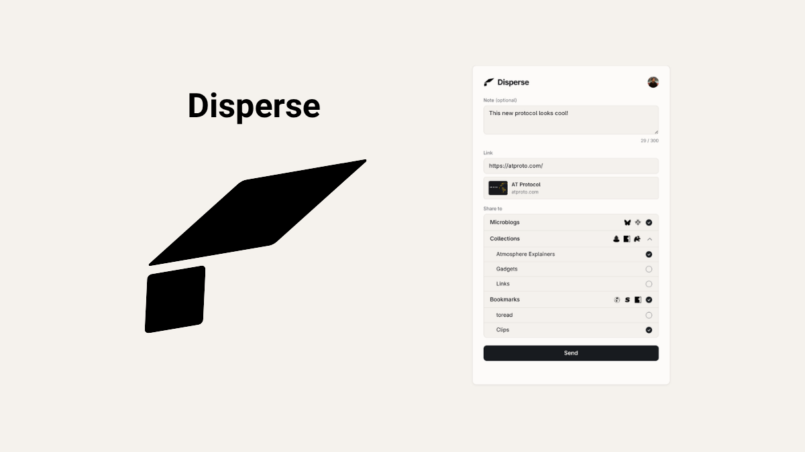

Over the last few months, I've been thinking through what services that cross the Atmosphere would look like. It's led to a few experiments that are worth sharing, so here's the first one.

[Disperse](https://disperse.social) is a website, bookmarklet, linkable service, and (soon) a browser extension that allows you to share in several different formats across the Atmosphere all at once. It uses the unique account and data ownership of Atmospheric accounts, and helps people discover apps in the ecosystem beyond Bluesky.

The thought behind this was "What if we build a service like Buffer from the ground up for the Atmosphere?" In short, it would mean not having to directly integrate with other services, automatically adopting new services that speak in the same formats, and - most importantly - giving the user a view of all of the different destinations they can share to without needing to create multiple accounts.

### Destinations, not Services
[Disperse](https://disperse.social) uses the basic mechanics of reading and writing directly from your [Everything Account](https://augment.ink/the-everything-account/), or "Atmosphere account", rather than integrating directly with any service.

When you bring a link to [Disperse](https://disperse.social), it invites you to share in three ways:
* Microblogs that show up in Bluesky and Blacksky feeds
* Collections that you are a part of in Semble, Margin, and Rabbithole
* Bookmarks that you can come back to in Kipclip, Sill, and Margin

When you send to microblogs, [Disperse](https://disperse.social) writes the post into your account - not to a service - then, lets services like Bluesky and Blacksky ingest it and distribute it. Simple as that.

When you want to add to a collection, we look at the various collections you already have in your Atmosphere acccount that are compatible with Semble, Margin, and Rabbithole. When you add the link, we add it to your account - again, not a service - in the format that makes sense. Since all of these services interoperate, whatever collections you add to will be ingested and distributed by all the services.

Finally, when you want to add a bookmark, we also give you the option to add tags that you've created in Kipclip. Once again, these bookmarks and tags will be added to your account - say it with me, not sent directly to a service - and will be ingested by Kipclip, Sill, and Margin so you can revisit them later.

The best part about all of this is that when new platforms and services use the same formats as the ones above, [Disperse](https://disperse.social) doesn't need to do any extra work to support them. New services will automatically ingest the link in the formats available, and you'll have more distribution without either of us doing any extra work. 

That's not any magic by me, that's just how the Atmosphere works.

### How do I Disperse?
You can use [Disperse](https://disperse.social) in four ways: the website, a bookmarklet, a link from your site, or (soon) a browser extension.

To use on the website, go to [disperse.social](https://disperse.social) and start Dispersing! 

To add as a bookmarklet, **[drag this link](javascript:(function(){window.open('https://disperse.social/share?url='+encodeURIComponent(location.href),'_blank','width=540,height=800');})();)** to your bookmarks bar.

If you have a publication/blog, and want to be able to add it as a sharing option, you can use this block of code like I have across all the posts on augment (including this one!):
```
<a href="javascript:(function(){window.open('https://disperse.social/share?url='+encodeURIComponent(location.href),'_blank','width=540,height=800');})();">
  Share with Disperse
</a>
```

And, soon, Disperse will have Chrome and Firefox extensions as well.

### Open Source and Open For Features
[Disperse](https://disperse.social) is fully open source, and you can find the official repo on [Tangled](https://tangled.org/quillmatiq.com/disperse) along with mirrors on [Blacksky Forge](https://forge.blacksky.community/quillmatiq.com/disperse) and [GitHub](https://github.com/quillmatiq/disperse).

I already have a few other features in mind for Disperse, including a PWA with native mobile sharesheet integration, being able to search across collections and bookmark tags for folks who have a lot, and so much more. If there's any feature you want, feel free to [cut an issue on Tangled](https://tangled.org/quillmatiq.com/disperse/issues/new).

I hope you enjoy using [Disperse](https://disperse.social) as much as I enjoyed building it, and that it's useful for your Atmosphere sharing needs.
