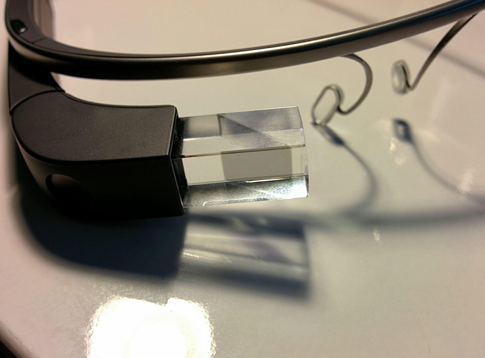
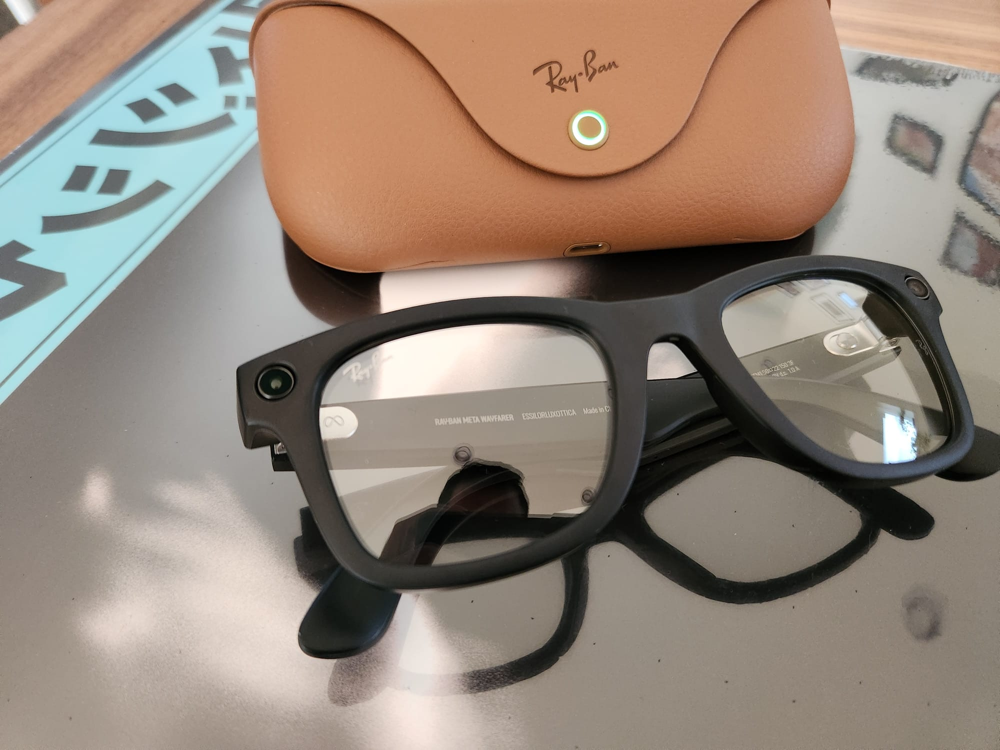
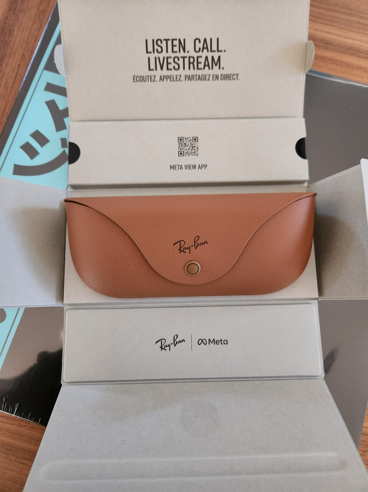

Every once in a while I use a device that reminds me how delightful technology can be when it fades into the background until you need it. And when it's not there you wonder why you didn't bring it along in the first place.

The Ray-Ban Meta Smart Glasses are one of those devices. They've quickly become my go-to sunglasses, outdoor headphones, and instant camera all at once. Luckily, they arrived at my doorstep in time for a trip to Japan where I took it through its paces to fully understand how these glasses fit in my life.

I've owned them for about a month and wanted to share my thoughts about what I like, where they could improve, and what I think Meta needs to do to realize this device’s full potential.

But before we jump into that, I want to talk about another gadget that's close to my heart.

### Glass from the Past
My Google Glass, taken in 2013
I loved Google Glass. It’s almost embarrassing to say it at this point. The world has moved on from “Glassholes”, Google has moved on from taking any hardware risks whatsoever, and most companies are focused on bulky VR/AR/MR/Spatial headsets.

But I loved it.

I didn’t like how it looked, mind you. I didn’t like the tinny-sounding bone conduction speaker on only one side that did not so much send sound as it did gently tickle your temple. I didn’t like that it got uncomfortably hot. I didn’t like that it had a camera that wasn't clear about when it was recording.

It was the concept I loved. The idea of putting an assistant in your ear, an ambient screen that only lit up when you looked at it, and a POV camera all in one device felt like the future. But Google didn’t balance this futuristic vision with societal norms and dug their heels in when the world told them so.

Then they gave up.

So why indulge myself in a trip down memory lane for this particular defunct device? Well, I think for the first time in a decade I finally feel that same excitement with a new device. And this time it didn’t come from Google, who has more or less given up on putting a computer on your face. It came from Ray-Ban and Meta, the latter of whom is very dedicated to putting a computer on your face, one way or another.

### Classic Elegance, Modern Utility

The Ray-Ban Metas are simple to explain. You take some Ray-Bans, slap a camera on one side and a ring-light on the other, then throw in some speakers and a mic on the temples. If you've never seen them before and are imagining them in your head right now, you're probably pretty close to what they actually look like.
The Ray-Ban Meta Smart Glasses with case
As I walked around Japan, no one could tell I was wearing smart glasses until the ring-light indicated that the camera was in play. That was a nice change from the double-takes I'd get with Glass.

The case also looks like a traditional Ray-Ban one with one clever trick - it has magnets along the nose-bridge that satisfyingly snap into the case to charge them. Super convenient and keeps the glasses safe when you don't want them on. That being said, I don't think I ever had to think about charging them - I could go a couple days without plugging in the case.
Ray-Ban Meta Charging Case
If Google Glass wanted to push society toward the future, these glasses are inching you only a couple steps forward from the present. Meta didn't take any major swings here and I think for a second-gen device that was the right choice.

### Look, Ma - No Hands!

The Ray-Ban Metas are now the best camera I own. It's not because they take glorious photos and videos - they're actually quite average. The reason is because they're ready to go whenever I need them without any fuss. See something neat? Snap. Want to go POV for a walk along a boardwalk? Done. No need to bring out your phone, open the camera, then obscure your view with a viewfinder that you constantly have to look at.

> [
> 
>  Post by @quillmatiq
> 
>  View on Threads
> 
> ](https://www.threads.net/@quillmatiq/post/C2sA_DtR05n)

As I walked through Shibuya Scramble Crossing, I saw phones out as people bumped into each other, not being able to actually experience that moment. With the Ray-Ban Metas, I end up saving more memories and I get to lose myself in the moment I'm actually in. I didn't think about the recording, I just walked and enjoyed what was in front of me. I can't wait to bring these to a concert.

> [
> 
>  Post by @quillmatiq
> 
>  View on Threads
> 
> ](https://www.threads.net/@quillmatiq/post/C2sA_DtR05n)

The Ray-Ban Metas hit the content creation gold mine as an instant camera, but there was a learning curve since the camera is positioned on the left side of the glasses. While my early shots required me to think about the camera, I eventually got acquainted with the field of view and my recordings came across more natural. I still don't like that only one side has a camera since it means the POV is at a slight offset, but it doesn't bother me as much as it did when I was trying to get perfect recordings.

I also really dislike that you can only take vertical content. I get it - these were made for Reels. But it fails to connect the dots to the future that Meta themselves promises, which is being able to experience POV content in full VR. This device feels like it should be a trojan horse that makes people want to see their creations in Meta's more expensive and capable headsets and yet there's no connection to the two product lines at all. Even Apple launched spatial video for iPhones shortly before the Vision Pro came along.

If you notice, my nits really fall under one bucket: a single camera that limits the output of the device. There's nothing wrong with making a Reels device but it's limiting what these glasses can actually be for Meta's long-term goals. But mainly, I just want the option to have horizontal videos.

All that said, I find myself always picking these up when I'm going out. I need sunglasses anyway, why not take ones that have a camera attached to them?

And the best part is that they triple up as pretty decent outdoor headphones.

### Noise-Accepting Headphones

Remember how I said I hated the bone-conduction headphones on the Google Glass? While I disliked those, I did find it compelling to have headphones that naturally let ambient sound in rather than the "transparency modes" of noise-cancelling options. I wanted natural sounds and I didn't want a device in or on my ears all day.

A few years ago, I picked up the AfterShokz Aeropex (now the [Shokz OpenRun Pro](https://www.amazon.com/dp/B09BVXT8TJ)), bone-conduction headphones with much better sound quality than Glass, and they quickly became my and my partner's most-used audio option. They do a great job of not leaking audio - which makes them perfect to use around the house - and get loud enough to hear on the street or at a busy grocery store. I still need my noise-cancelling Sony XM4s for flights and louder environments, but I've now bought two generations of Shokz headphones and I don't think I'm looking back any time soon.

The Ray-Ban Metas went a different direction and opted for speakers that sit close to the ears rather than bone-conduction. They get louder than the Shokz and have comparable sound quality which makes it perfect for outdoor use. Now, when I go out on a walk or go to a store, I pick these up instead of my Shokz.

But the major issue with these is the sound leakage - the moment I get the volume to a decent level, everyone around me can hear them. So while I take these out all the time, I'm still picking up my Shokz when I need headphones in quiet environments. A part of me wishes that these glasses used bone conduction, but that would require the temples to sit much closer to the, well, temples and that's not an option for non-custom glasses. They've done the best they can with the given hardware but I hope they find a way to resolve the sound leaking in future versions.

### Forgettable AI, for now

The Ray-Ban Meta Smart Sunglasses will eventually get a multi-modal AI chatbot that is currently in limited preview. I'm not in that preview so I could not review those features but I'm really excited about the prospect of being able to ask about things I'm looking at.

For now, the AI features I have are limited to questions you would expect to ask Google Assistant, Siri, or Alexa. Quite frankly, I'm pretty burnt out by voice assistants and the last thing I need is another device telling me what the weather is like so I didn't feel like using the Meta AI all that much.

Once I get the multi-modal features I can see myself using this a lot more - especially on trips like Japan where I can ask "what is this?" while staring at one of the numerous shrines for more information. But, for now, it's as useful (read: forgettable) as my other voice assistants.

### The Missing Piece

So how do they make the AI less forgettable and make this device significantly more useful? Here's the part where I tell Meta that they need to steal a couple pages out of Glass's book: an ambient screen.

I would be less annoyed by the POV offset if the device had a viewfinder or instant replay of whatever I just captured. I would probably use the AI a lot more if there were visuals attached to it. Navigation instructions in front of my eyes would be endlessly useful. Maybe even steal a Pixel feature and show what music is playing in the background if I look up at the screen without a request. A screen would unlock so much more of this device's potential and I found myself frustrated multiple times at Meta's insistence on not pushing any boundaries.

To push this device category further, I think Meta would greatly benefit from a Pro lineup of glasses that pushes the envelope a bit. Two cameras and a screen alone would bring these closer to perfection. Rumor has it that the 2025 version of these will at least have a screen. Here's to hoping.

### Promising Future

The Ray-Ban Metas will remain in my device rotation for the foreseeable future. There's just so much to love about these. I've captured so many more memories on this than I would have without them, especially during the busy moments of a trip.

We're in the early years of this form-factor, but I think Meta is very close to having the next major device category for the average user. Even my partner who's usually skeptical about wearables realizes the benefit of having these on my face.

But what Meta is trying to do will require a bit more of a leap. The kind of leap Microsoft made with the Surface or the one Apple took with the Watch - taking an existing form-factor and advancing it forward for a new generation.

Perhaps Google Glass leapt too far too early. But if there’s a company I think can find something in between that and the Ray-Bans, I’m now convinced it’s Meta.

*Thank you for reading! I'll be continuing to post about my journey with the Ray-Ban Metas on *[*Threads*](https://www.threads.net/quillmatiq)* so follow me there if you're interested or have any questions for me. And if you want to be notified of future issues of augment, you can *[*subscribe here for free*](https://buttondown.com/augment)*!*
