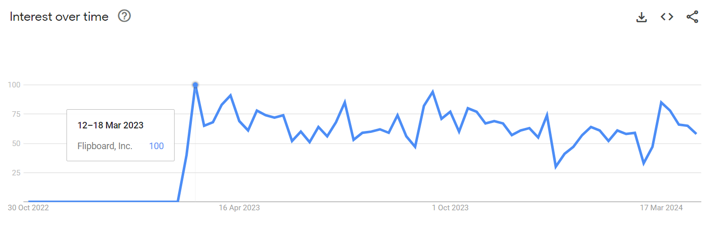

Today, the social platform [Post](https://post.news/) announced [its official closure](https://post.news/@/noam/2fJw4PYRFjya343RpiToiyEQr0x). While it may not have received the excitement you see behind other similar services, it was clear that the team was deeply interested in what a post-Twitter world could look like for journalism. The service had a lot going for it: microtransactions to read single-serve paywalled content, topic tags right out the gate, and a polished user experience - especially for a product so new.

There were some early signs that Post was going to have a rough time, though. For one, the product launched as a PWA (Progressive Web App, an installable website) rather than a native app for mobile platforms. I love PWAs ([I use one for Threading on Mastodon](https://augment.ink/threads-on-mastodon/)!) but for most users, if you're not distributing your social product through the App Store or Play Store, you don't *really* exist. That was a rough start, but likely was not the only reason.

## The Silos

The other sign was that while the tides were turning over on Twitter and people began seeking a transition to another service, most power-users' eyes were not turning to closed networks. Instead, they were looking to platforms that supported open protocols like ActivityPub (used by Mastodon and soon [Meta's Threads](https://engineering.fb.com/2024/03/21/networking-traffic/threads-has-entered-the-fediverse/)) and AT ([Bluesky](https://bsky.app/)). 

Now, most power users didn't choose these specific platforms *because* of the option of interoperability or portability, but it was likely the reason they weren't ready to invest in new networks that didn't provide it. The trauma of losing their Twitter follow graph hit hard and they wanted options that would make it easy to transition from one platform to another without the friction of starting at zero. Post was not providing that option.

Similarly, another promising social news product that couldn't find its way was [Artifact](https://artifact.news/), an app built by the founders of Instagram. It had useful features like AI summaries, writer profiles, a For You feed, and a well-designed user experience. It also had a closed social network similar to Twitter. It recently [shut down](https://medium.com/artifact-news/shutting-down-artifact-1e70de46d419) and [Yahoo acquired them](https://www.yahooinc.com/press/yahoo-announces-the-acquisition-of-artifact-the-news-discovery-platform-created-by-instagram-cofounders-kevin-systrom-and-mike-krieger) for their AI features, not the social network. I don't think federating with ActivityPub would have made it a billion-dollar company, but I do believe it would've been a valuable tool for news-focused social users that wanted to find content to share to their larger followings on generalist networks. A niche network for dedicated news enthusiasts that used their Artifact interest graph to find what to curate to their followers without needing multiple accounts to do so.

In other words, neither of these products tapped into the endless supply of creators, curators, and consumers that existed across other networks and instead cold-started their graph hoping it would heat up just based on great features.

## The Endless Supply

Why am I so convinced that federating would have at least helped these products survive as niche offerings? Well, I worked at Flipboard when things were changing at Twitter and we realized that a closed network wasn't healthy for the wider social web. Products like Flipboard didn't work *with* Twitter, they worked *for* Twitter and while an internal closed network existed in Flipboard, I wouldn't say it was destined to take over the role of the de facto microblogging platform.

This time, we needed to work *with* other social products. Our eyes turned to Mastodon and Bluesky so we could build social features that weren't tied down to our own network. We launched a [Mastodon server](https://flipboard.helpshift.com/hc/en/1-flipboard/faq/1564-join-mastodon-at-flipboard-social/) for users of Flipboard; we allowed you to connect your [Mastodon](https://flipboard.helpshift.com/hc/en/1-flipboard/faq/1565-use-mastodon-inside-flipboard-ios-android/), [Bluesky](https://about.flipboard.com/inside-flipboard/connect-bluesky-to-flipboard/), and [PixelFed](https://about.flipboard.com/inside-flipboard/you-can-now-connect-your-pixelfed-account-to-flipboard/) profiles to your Flipboard account; and, more recently, [Flipboard federated 11,000 magazines](https://about.flipboard.com/press/flipboard-opens-11000-curated-magazines-to-the-fediverse/) so they can be followed on the Fediverse. 
Flipboard launched a Mastodon instance and account integration in Feb 2023. [[Source](https://trends.google.com/trends/explore?date=2022-11-01%202024-04-19&amp;geo=US&amp;q=%2Fg%2F187cd17k&amp;hl=en-GB)]
All of this has breathed new life to the product and it's hitting its peak of interest once again. It's turning into an app specifically built to help curators find content to share to a wider set of external networks and people are seeing the benefits of it. It's now another giant pipe in the endless supply of the open social web and I think Flipboard has a whole lot more coming when it comes to working with these open protocols.

Flipboard isn't alone in looking at their existing social features and opening them to open networks either - [Medium](https://blog.medium.com/medium-embraces-mastodon-19dcb873eb11), [WordPress](https://wordpress.com/support/enter-the-fediverse/), [Ghost](https://techcrunch.com/2024/04/15/open-source-substack-rival-ghost-may-join-the-fediverse/), [Flickr](https://techcrunch.com/2022/11/28/flickr-weighs-support-for-activitypub-the-social-protocol-powering-twitter-alternative-mastodon/), [Mozilla](https://blog.mozilla.org/en/mozilla/mozilla-launch-fediverse-instance-social-media-alternative/), and the list goes on. Even [podcast services](https://podcastap.com/) are starting to add ActivityPub support. The endless supply of the Fediverse is real.

## The Rise of Niche Networks

As one of the co-founders of the ActivityPub protocol, Evan Prodromou, said in [his recent essay about TikTok Notes](https://evanp.me/2024/04/19/bytedance-add-activitypub-to-tiktok-notes/) not being a part of the Fediverse:

> "New social services need a good justification for why they are launching in siloed mode in 2024" - Evan Prodromou

While I'm sad to see Post and similar products shut down, I think the greatest miss was not interoperating with complementary products like Flipboard, Artifact, WordPress, Medium, and Ghost to build out a cross-platform network of journalists, curators, and news consumers that could choose the experience that made sense for their use case without having to choose a silo. 

I've always been of the belief that [good products don't need lock-ins and great products make it easy to leave](https://www.threads.net/@quillmatiq/post/C4yJasAxgnn/?xmt=AQGz8ANeAA_Xm7elWDQm53jJZ5dRDEZ8i0yUeZSpQSAmtw). There will never be a social media experience that makes sense for everyone and federation means being able to try a diversity of options while being able to hold onto the same network. Users won't have to choose the option that the majority have agreed is "good enough", they'll be able to choose the option that works best for them. And if you're not enabling users to do so, you'll likely be left behind no matter how great your product is otherwise.

Federation isn't just beneficial for Mastodon or Meta, it's an enabler of niche communities that can cater to specific needs. The open social web's network effects are now in motion - if you're not piping your platform's content into it then you and your users are missing out on what's going to be the largest sharing network we've ever seen in social media. 

*Thank you for reading! I'll be continuing to post about the Fediverse on *[*Threads*](https://www.threads.net/quillmatiq?ref=augment.ink)* and *[*Mastodon*](https://mastodon.social/@quillmatiq?ref=augment.ink)* so follow me there if you're interested or have any questions for me. And if you want to be notified of future issues of augment, you can *[*follow on RSS*](https://augment.ink/rss/)* or *[*subscribe here for free*](https://augment.ink/#/portal/)*!*
