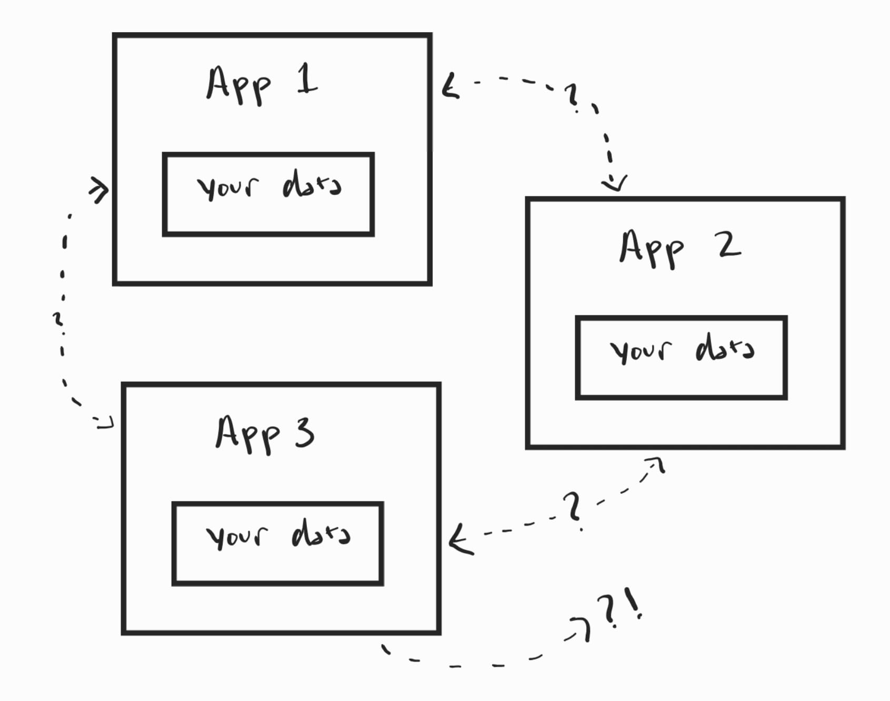
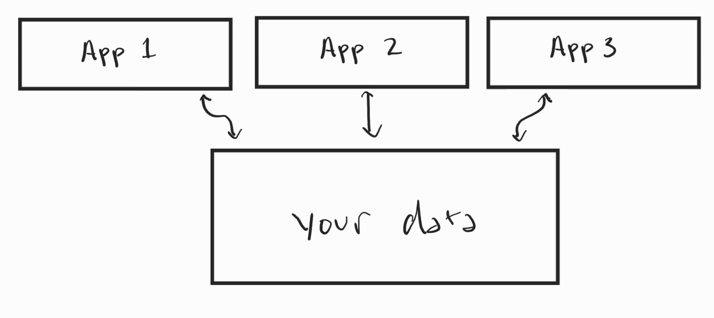
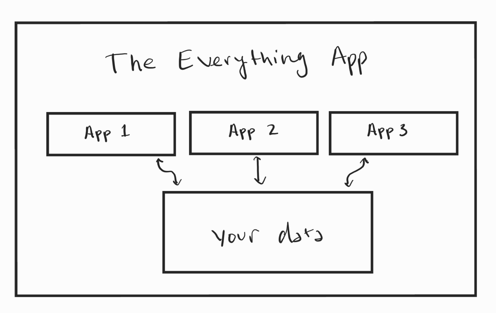
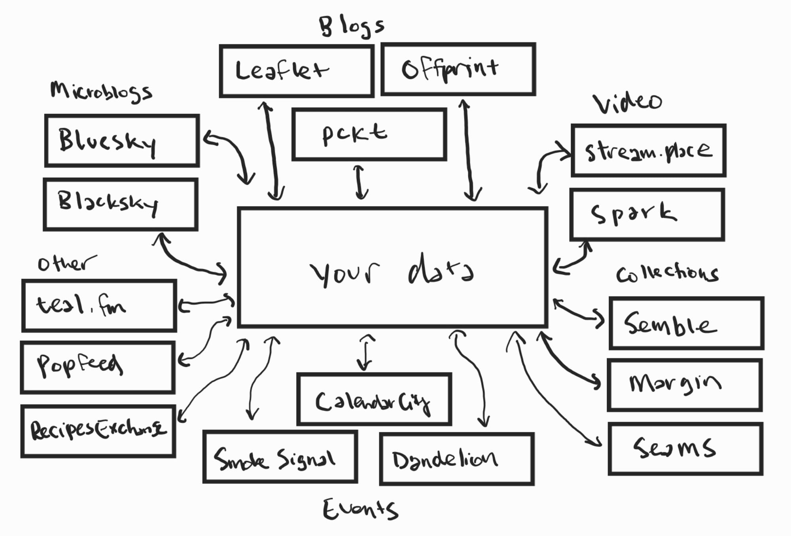

I've been thinking a lot about our accounts lately. We all have an ever-growing pile of digital identities scattered across the web, many forgotten after a brief stint with a random service we found in an app store.

It's like second nature at this point: we check out a new service and fill in the usual suspects: first name, last name, email, username, password (better confirm it!), address (wait, why does my to-do list need that?), credit card (you guys are getting paid??), etc. After that, we call them all "*my* account": "my Google account", "my Instagram account", "my Reddit account", "my X account". 

But are these *your* accounts? Who has the power to suspend it, or worse, shut it down? Who has the power to tell you the features you're allowed to have because the features you want "don't drive growth"? Who has the power to take the app you have your account on, sell it to the Worst Person You Know, and turn it into something completely different that doesn't align with your needs and values?

[Let that sink in](https://www.theguardian.com/technology/2022/oct/26/elon-musk-twitter-visit-sink).

### Not Your Accounts

The problem with our accounts is that they aren't *our* accounts. They're accounts owned by Google, Instagram, Reddit, and X. And when any of these organizations wants to go rogue, all you can do is say "wow, that sucks," and keep using it because starting from scratch with another service is *hard*.

And what makes it hard is simple: they have our data, including our posts, our relationships, and so much more, and we can't take it all elsewhere. The data you've created in an app is directly tied to the app itself, and the companies behind it hoard the data because they know it's what gives them the power to hold on to you.

This account model that we're used to looks something like this:

Each app is in its own silo, holds our data within it, and if we want a feature from App 1 to use data from App 2, we have to hope that the two companies cooperate. And if you ever want to leave App 3? Well, you have to hope they let you export your data and hope it's in a format that App 1 and App 2 can handle, or you're starting from scratch.

That's a whole lot of hoping for an account you call "yours".

### Separating the Data

But what if we could change that model so the company behind the app didn't own the data we created in it? What if across all these apps, we could store our data in a separate place of our choosing, and then give other apps permission to use that data without needing the two companies to cooperate?

That would look something more like this:

By separating the data from the app, I can suddenly share data between App 1, 2, and 3 without each company's permission, because *I* own that data. *I* get to choose who sees what and how they use it. 

So how do we get there?

### The Everything App

There's a common concept known as "The Everything App": a single app that contains a series of sub-apps, all under a single account. An example is the popular Chinese app [WeChat](https://en.wikipedia.org/wiki/WeChat), which offers messaging, payments, a full social network, and mini-apps that other companies can build to live inside it.

This simplifies the model we're used to by not requiring you to create a new account for every app. The Everything App stores your data in a shared location within it, and other apps can use it as long as you give them permission.

The Everything App model looks like this:

While this may look similar to the second model we shared above, since the data is separated from the sub-apps, there's a major underlying issue: your account still isn't yours. The account is owned by the company that owns The Everything App.

If the company that owns The Everything App gets bought by the Worst Person You Know, you're even more trapped because it has so much more than just your data. It owns your whole digital experience from top to bottom.

When I say we need to separate the data, I mean your account needs to be completely separate from any app, including The Everything App. So, this solution isn't quite what we're looking for.

### The Everything Account

This brings us back to our original ideal model once again:

Here, our account and its data are free from the shackles of an Everything App. Instead, the account lives on its own, granting access to apps of our choosing. When App 1 no longer serves its purpose, we simply sign in to App 2 or App 3 and grant them permission to modify our data. Or we can use all three based on our needs because the apps no longer dictate how we use our account.

This account, which can use everything, is what I've been calling "The Everything Account". It's a future where people have power over their app experience. No single company owns the account or its data, and, more importantly, we get to choose where it lives, can change where it lives when we want, and choose which apps get to use it.

An Everything Account is one that *you* actually own, no one else, and you bring it wherever you choose to. It doesn't live inside another app; other apps simply orbit it based on your needs.

The good news is that such an account already exists and is already used by millions of people every day, some of whom may not even know they have one.

### Welcome to The Atmosphere

This ecosystem, where a user's data lives separate from the apps they use, is commonly known as **The Atmosphere**.

There are many other parts to The Atmosphere, but the core of why I think it's a better model for our accounts is because it puts the user – their account and their data – at the very center of the ecosystem.

If I were to reorient the above diagrams, The Atmosphere would look something like this:

The Atmosphere, as you can see above, already has countless apps you can use. There are Twitter-like apps such as [Bluesky](https://bsky.app/) and [Blacksky](https://blacksky.community/); blogging services like [Leaflet](https://leaflet.pub/), [Offprint](https://offprint.app/), and [pckt](https://pckt.blog/); collection and annotation tools like [Semble](https://semble.so/), [Margin](http://margin.at/), and [Seams](https://seams.so/); and I can go on and on because the ecosystem is expanding by the day. And this is just a small portion of the existing Atmosphere - I couldn't fit all of the different apps because there are *just. so. many.* Perhaps in a separate post.

In this ecosystem, I can switch between Bluesky and Blacksky, and my profiles on both have all my posts, relationships, and other choices, because they pull them from my Everything Account – that box of data in the center. No one app owns my experience anymore, and I can leave and arrive as I please without missing a beat. And you can do this with any app, not just social media.

The Atmosphere is an ecosystem that respects your agency as a user, and it's one of many ways we can start taking back control of our online experiences. Whether you're a user or a builder, you no longer need to hold onto hope that a giant company does the right thing for you. You can take your Everything Account across The Atmosphere without the permission of any other entity.

You can find an entry point to The Atmosphere via any of the above apps, and you never have to make another account for any of the other apps again. You arrive, create your Everything Account, and take it everywhere you go.

Your Everything Account – your account on The Atmosphere – is *your* account. And it's about damn time we had an account that actually is.

### Further Reading

If you're interested in learning more about how The Atmosphere works, there are many great posts that explain it in greater depth. Here is a very short list of them if you want a deeper dive:

**Non-Technical:**

- [The Last Social Account You'll Need](https://blog.joebasser.com/3mdvuirqog22z) by [Joe Basser](https://bsky.app/profile/joebasser.com)
- [Social media’s next evolution](https://newpublic.substack.com/p/how-blacksky-grew-to-millions-of) by [Rudy Fraser](https://blacksky.community/profile/did:plc:w4xbfzo7kqfes5zb7r6qv3rw)
- [Publishing on the Atmosphere](https://tynanistyping.offprint.app/a/3mcsvjjceei23-publishing-on-the-atmosphere) by [Tynan Purdy](https://bsky.app/profile/did:plc:6ayddqghxhciedbaofoxkcbs)
- [ATproto: The Enshittification Killswitch That Enables Resonant Computing](https://www.techdirt.com/2026/01/27/atproto-the-enshittification-killswitch-that-enables-resonant-computing/) by [Mike Masnick](https://bsky.app/profile/masnick.com)
- [Beyond Bluesky](https://techcrunch.com/2025/06/13/beyond-bluesky-these-are-the-apps-building-social-experiences-on-the-at-protocol/) by [Sarah Perez](https://bsky.app/profile/sarahp.bsky.social)
- [What Does It Mean To Be Friends?](https://newsletter.danhon.com/archive/s21e02-what-does-it-mean-to-be-friends/) by [Dan Hon](https://bsky.app/profile/danhon.com)
- [How To Migrate Your PDS](https://blacksky.community/profile/did:plc:g7j6qok5us4hjqlwjxwrrkjm/post/3matfjyzya22d) by [dapurplesharpie](https://blacksky.community/profile/did:plc:g7j6qok5us4hjqlwjxwrrkjm)

**Somewhat Technical:**

- [Atmospheric Computing](https://www.pfrazee.com/blog/atmospheric-computing) by [Paul Frazee](https://bsky.app/profile/pfrazee.com)
- [A Social Filesystem](https://overreacted.io/a-social-filesystem/) by [Dan Abramov](https://bsky.app/profile/danabra.mov/)
- [ATProto explained for a slightly "technical" audience](https://foxes.kyefox.com/3ly4qwtlagc2w) by [Kye Fox](https://bsky.app/profile/kyefox.com)

**Technical**

- [Introduction to AT Protocol](https://mackuba.eu/2025/08/20/introduction-to-atproto/) by [Kuba Suder](https://bsky.app/profile/did:plc:oio4hkxaop4ao4wz2pp3f4cr)
- [Where It's at://](https://overreacted.io/where-its-at/) by [Dan Abramov](https://bsky.app/profile/danabra.mov)

**Explanations via Tools**

- [@me](https://at-me.zzstoatzz.io/) by [nate](https://bsky.app/profile/zzstoatzz.io)
- [waow.tech](https://waow.tech/) by [nate](https://bsky.app/profile/zzstoatzz.io)

I'm sure I've forgotten numerous gems, so please reach out if I did, and I'll be happy to add them!

---

*Thank you for reading! You can follow me on *[*the Atmosphere*](https://bsky.app/profile/quillmatiq.com)* or *[*the Fediverse*](https://mastodon.social/@quillmatiq)*. And if you want to be notified of future issues of augment, you can *[*follow on RSS*](https://augment.ink/rss/)* or *[*subscribe here for free*](https://augment.ink/human-generated-content-9/#/portal/)*!*
