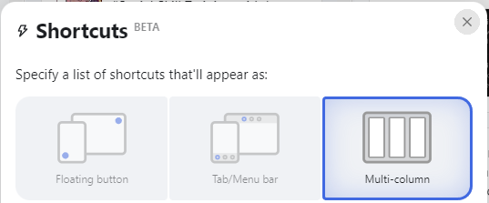
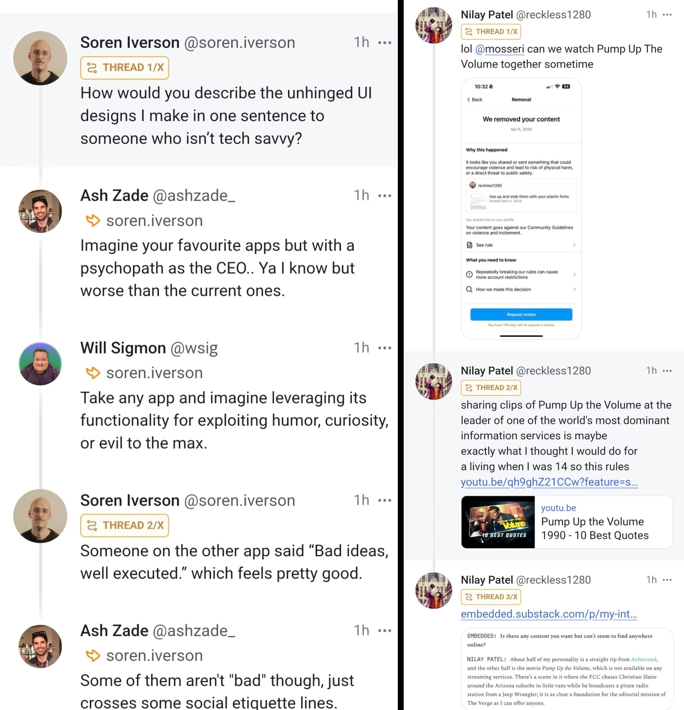
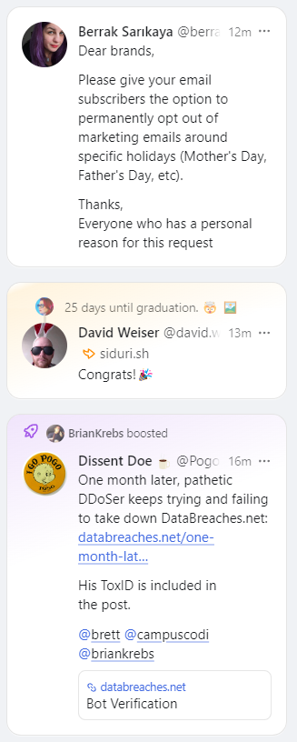

Last month, Meta's Threads took its [first step into the Fediverse](https://engineering.fb.com/2024/03/21/networking-traffic/threads-has-entered-the-fediverse/), a promise they made to users at launch. While I don't want to dive too far into the technology, which is something I will do in a future post, this basically means I can follow Threads users that opt-in to Fediverse integration through my Mastodon account. 

So, I did what any "normal" person would do: I went to my Mastodon account and added anyone I follow on Threads who had their Fediverse switch turned on so I could see their posts on Mastodon. And then I started taking notes. 

This is my journey that started as an experiment to see how my Threads feed would look like on Mastodon and ended with me finding experiences that went above and beyond my expectations.

## Nothing is Perfect

To start, this post isn't a long-winded way of me saying I hate the Threads experience. On the contrary, they've made some delightful choices. It's why I've been so active on the platform for this long. 

My current need to look outward is more focused on what they *haven't* built and likely never will. Nothing is perfect for everyone and neither is Threads.

Firstly, the app always defaults to the For You feed. I think this makes sense for most users, but it would be nice if power users were given the ability to default to a chronological feed.

Speaking of the chronological feed - frankly, it's not useful. It skips posts without explanation and there are no replies, which means no conversations in that feed. You only see replies serendipitously in the For You feed so only Threads can decide which conversations you take part in.

There are also no lists. From the way it sounds, there will never be lists. I can go on for hours about what makes lists useful - and boy, have I - but I'll save that for another day. The point is, I use lists to make sense of the chronological feed - almost like a hand-crafted For You feed that...no, we're not doing this today.  The point is, I need lists and Threads doesn't seem to be interested in catering to that need.

Finally, the main reason I'm considering my options is the limited developer API. To put it short: there will be no third-party clients or augmentations of your Threads feed. The feeds Threads gives you are the feeds you'll have to live with. And, as I mentioned above, those feeds are not doing what I need them to do. 

And so, I looked to the next biggest thing that will let me interact with Threads while giving me more options for how I consume my content: Mastodon.

## Known Limitations

In this first phase, however, there is an important issue that will be ironed out once integration is complete: while Mastodon users can interact with Threads users, Threads users cannot interact back. That means: 

1. Threads users can't reply to Mastodon comments or see them in Threads.
2. Threads users can be followed by Mastodon accounts but they will not be notified nor can they follow back.
3. Likes from Mastodon are not counted toward your Threads like count

Moreover, as of writing this post, 189 out of 1524 of my Threads follow list is captured. While there may be more than what I currently have, that's about 12% of my follow list. Based on my conversations with various users, it seems like there are three popular reasons for why this may be the case:

1. It isn't rolled out in their region yet but they plan on switching it on.
2. They don't like the one-way integration and are waiting for full interaction with Mastodon users.
3. They don't like that there's a chance their post will remain indexed on Mastodon even if they delete it.

The first two will be solved, but the last one isn't going to be easy and it's not in Meta's hands. I hope this changes in the future but I would understand if certain users didn't want to be spread across the internet that way.

But, knowing all this, I pushed forward to customize my experience.

## Organizing the Chaos

So here I was - a Mastodon user who has about half his following list sourced from Threads. I started by moving all my Threads follows [into a separate list](https://www.threads.net/@quillmatiq/post/C5TtlzKRxEq) so that it wouldn't fill my main Mastodon feed. I used the handy [Mastodon List Manager](https://www.mastodonlistmanager.org/), segregated my Follows by domain, and added the whole threads.net section to the Threads list. Then I switched on the Advanced UI (think TweetDeck for Mastodon) to get my real-time multi-column feed. 

The reason for separating Threads users was to see how a real-time chronological feed for my Threads would actually look like. I also had to interact with Threads posts differently since it's only one-way interaction for this phase - I had to pop out of the Mastodon experience by opening the post on Threads and interacting there. Luckily, most Mastodon clients - including the default one - make this pretty easy and by separating my Threads follows in an independent list, I could be consistent with that workflow.

As expected, the chronological feed became overwhelming to follow. But there was an easy solution - I used lists. This made my feed easier to consume and it enabled me to focus on specific topics based on my mood. When I wanted to chat with online friends in the Tech Threads community, I would stay in a feed dedicated to that. If I was catching up on tech news, I would stay in that feed. When I was ready for heavier news, I would head over to my politics feed.

It was nice to able to decide what kind of content I wanted to consume rather than getting an algorithm's scrambled egg of the day that doesn't consider what mood I'm in. But not all was perfect in my Mastodon experience, even if I put aside the one-way Threads limitation. 

The main downside was that its UI is utility-first, design second. And coming from the polished Threads experience it left me a little unsatisfied. For instance: if a user does a multi-post (a thread), they come in reverse chronological order; the same is for conversations. In my opinion, threads and conversations should be grouped together in the UI to keep context. This, along with some other nits, left me wanting more.

## The Client Search

But there's a major benefit to Mastodon: it provides a full API so that third-party developers can augment the experience for specific needs, even niche ones like mine. The lists manager I spoke about earlier is one example of this. [Flipboard is another](https://flipboard.helpshift.com/hc/en/1-flipboard/faq/1565-use-mastodon-inside-flipboard-ios-android/) for a links-focused view. And the many - [there are SO many](https://joinmastodon.org/apps) - third-party clients are all examples of how a user's needs can be met even if the default options don't.

With an ample amount of choices, I set out to find a client that matched my needs. I knew I wanted a few things that the Threads and Mastodon core experiences weren't giving me: a prettier UI, a real-time feed, and better feed grouping.

And I had a final ask: an easy way to catch-up if I hadn't looked at my feed for, say, 8 hours (a boy's gotta sleep, right?). What I wanted was something that did what a For You feed does but doesn't leave me endlessly scrolling. I figured I would find or build a separate tool since most clients would likely not serve that and there was no reason to limit my search for something so niche.

There were numerous options that I enjoyed using quite a bit. To keep things short, here were my favorites:

1. [Elk](https://elk.zone/) - a minimalist PWA that makes some fantastic choices for the UX
2. [Moshidon](https://play.google.com/store/apps/details?id=org.joinmastodon.android.moshinda&amp;hl=en_US&amp;gl=US) - an Android app that makes it easy to swipe between lists
3. [Focus](https://play.google.com/store/apps/details?id=allen.town.focus.mastodon&amp;hl=en_US&amp;gl=US) - a highly customizable Android app that includes a widget

I don't have an iOS device, but I've heard [Mammoth](https://getmammoth.app/), [Ice Cubes](https://apps.apple.com/us/app/ice-cubes-for-mastodon/id6444915884), and [Ivory](https://apps.apple.com/us/app/ivory-for-mastodon-by-tapbots/id6444602274) are all great options as well. But, as good as these experiences were, in one way or another they didn't scratch my itch.

And then, [I met Phanpy](https://phanpy.social/).

## Hello, Phanpy

From the moment I saw Phanpy, I knew this checked far more boxes than I was expecting any client to.

Phanpy can be as simple or a complex as you want it to be. Want a single feed that refreshes when you explicitly ask it to? Default. Want multiple-columns hidden behind a tab bar? Easy. Want a multi-column, real-time chronological feed? Go for you extremely-online feed addict (it me).
Phanpy's column options
It most certainly doesn't stop there. As it brings new posts in real-time, it also groups conversations and threads so you don't have to click around to get all the context you need to understand a single post. Here are two examples: the first is a thread with replies in between and the second is a three-post thread.
Conversations and threads in Phanpy
And sometimes there's multiple conversations happening at once - here's an example of a lively discussion under a post:
Multiple conversations under a post on Phanpy
Clean and easy to understand. And when a reply pops up in the feed, it brings contextual groups with it. It makes the chronological feed so much easier to follow, especially when you're running a multi-column dashboard. To make things cleaner, original posts, replies, and reposts are all color coded to white, yellow, and purple respectively which helps break down the complex nature of microblogging feeds.
Post in white, reply in yellow, and boost in purple
So I'd found it: a pretty client that grouped posts in a real-time feed while making it easy for me to pop in and out of the Threads UI. And then Phanpy threw this in front of me:
Phanpy's "Catch Up" Feature
What you're seeing in the GIF above is "Catch Up", a Beta feature of Phanpy that collects all the posts in your feed between 1-12 hours (configurable per catch-up) and organizes them in a more sane way. You can filter by user or by post type (single, repost, or reply), sort by various attributes, and it extracts out all the links so you can see what popular news stories were filling your timeline for that period of time.

It's doing what a For You feed attempts to do but gives you the power of how you consume it. It also saves these sessions so you can go back when you're ready to check different parts of it, kind of like how I use my Tech and Politics lists. I typically run this in the morning to catch up while having my morning coffee. I also use it whenever I'm away from my feed for a while - working, social events, family time etc.

Somehow, I found a client that even hit my stretch goals. Did I mention it's a PWA so you don't have to download any apps? It just keeps getting better.

Like everything, Phanpy isn't perfect. For one, Threads posts federate 5m after posting but Phanpy will re-organize the feed chronologically. So if there's a Mastodon post that's been around for 2m and a Threads post makes it to my feed, the Threads post gets inserted underneath the Mastodon one. It makes sense but it's made me keep my Mastodon and Threads real-time feeds separate for the most part.

Phanpy also doesn't sync across devices which means that my preferences needed to be set up on each device I use it on. There's an experimental feature that does this, but since it uses my Mastodon profile notes I decided to hold off until it's production-ready.

There are some other limitations but overall, Phanpy hits enough notes for me that it's hard to complain. The code is also [completely open source](https://github.com/cheeaun/phanpy) so there's nothing stopping me from pulling it, making some changes, and hosting a bespoke version of the app just for me. Which I will likely do if I decide to move to a Mastodon instance once Threads completely federates.

## What now?

At this point, I haven't decided if I'll move my account off of Threads after federation is complete. I think there's a lot going for Threads, especially on the experience front. I also have a feeling that leaving Threads will mean leaving behind some people I follow since I'm pretty sure not everyone is going to turn the switch on, especially if Threads never adds the option to turn it on during the onboarding experience. I've made a lot of friends there and I would hate to cut the cord completely. But after experiencing Phanpy, it'll be very hard to go back.

Meta's goal was always to build something Twitter-like, but for a billion users. The reason Twitter never hit that peak is because normal users didn't understand it. From what I can tell, the design decisions Threads is making are for those consumers: a single For You algorithm, no real-time feed, and - say it with me - no lists. This basic experience will suffice for the 90% of users that mostly lurk, comment, and like and don't want all the hurdles of understanding how any of it works. They're the ones that open an app like Threads once every few hours, scroll until they're done with it, then move on.

If that's their goal, then - in my opinion - they're succeeding in making all the right decisions for that user.

Unfortunately, I am not that user. I know many people on Threads who are not that user. And I appreciate that Meta has opened itself up to let users like me interact with and send content to Threads from an experience that works for them without being limited to Meta's vertical experience. What a time to be alive, right?

After seeing the already-rich ecosystem of third-party clients - many of whom serve power-users and creators much better than Threads currently does - along with Meta's decision not to allow third-party clients at all, I'm heavily leaning toward Phanpy for Mastodon for the long-term once Threads federates. 

Honestly, though - would lists *really* be that bad, Meta?

*Thank you for reading! I'll be continuing to post about the Threads and the Fediverse on *[*Threads*](https://www.threads.net/quillmatiq)* and *[*Mastodon*](https://mastodon.social/@quillmatiq)* so follow me there if you're interested or have any questions for me. And if you want to be notified of future issues of augment, you can *[*follow on RSS*](https://augment.ink/rss/)* or *[*subscribe here for free*](https://buttondown.com/augment)*!*
